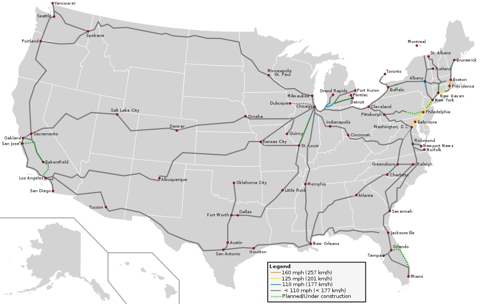

# Basic GIS Lexicon

A good way to start talking about GIS Lexicon is looking at a conventional map and analyzing the information it shows:

CC BY-SA 3.0 derivative work: User:Justthisonceokey Blank_US_Map.svg: User:Theshibboleth – Blank_US_Map.svg: 
User:Theshibboleth Routes derived from Amtrak-Streckennetz.svg Speed limits own work. Inspired by High_Speed_Railroad_Map_of_Europe_2013.svg

This map shows the current rail speeds in the United States. Even without a title, we know it’s the United States because we recognize its shape, and we also don’t need a legend to identify the state boundaries in white. Then we have railroad information (the lines) and their respective speeds (represented in different colors, according to the legend), plus cities that have railroads (red dots) and the states (gray polygons). We are going to refer to these points, lines and polygons as features.

Data in QGIS is organized in layers. To understand layers, imagine that you have several different onion paper sheets, each one with a different type of features. For example, you could have one onion paper sheet to display US states, another one to display only railroads, and a last one to display just the red dots that represent the cities, so that when you put them one on top of the other, they would look like the map above. Each of these features is represented as a vector, that is, scalable points, lines or polygons that can be easily created, edited, or deleted using QGIS.

Data in each layer is of the same type, so they can have comparable attributes. For example, in the cities layer, you could include population, and you could compare the population of Miami to the population of Dallas. You could also have total population in the states layer, but you couldn’t have it in the railroads one, as that wouldn’t make sense. Likewise, the railroads could have an attribute for average speed, but this attribute wouldn’t make sense in either the states or the cities layers. So, each layer will have its own attribute table, which is basically a spreadsheet showing each feature as a row, and each attribute as a column. Just like in stats software, attributes can contain data as strings (text), numeric, dates, or booleans.  GIS files will also include geographic data that tells QGIS what vectors to create for each feature (be it points, lines or polygons), that will be represented in space according to a Coordinate Reference System (CRS), which is basically a reference for QGIS to know how to transpose aspects in a three-dimensional spherical world into two-dimensional rectangular representations. All layers in your map must be on the same CRS, otherwise data will be inaccurate or even incompatible.

Bear in mind that data might not have geographic information but still be used in QGIS. For example, if you have an excel spreadsheet with data about the states, and vectors representing states but with no attributes, you can join them and all the data in the spreadsheet will become attributes for the vector layer. You could also start from scratch and draw yourself each state, but the result would likely be inaccurate. In any case, the process of using geographic data to represent features on a GIS is called georeferencing. You will likely not have to worry about georeferencing as most of the data you can find on the internet is already georeferenced. Vector layers are commonly shared in shapefile format (.SHP). Shapefiles in GIS generate many files with the same name but different formats, and they all need to be in the same location for QGIS and other GIS software to open them correctly. Remember this when saving and copying layers. To tackle this inconvenience, GIS software has evolved and allows to read compressed files (i.e. .zip, .gz) that already contain all of the related files required by the layer.

There are other types of layers besides vector layers. The other most common type of layer is raster layers, which consist of satellite images or maps for reference, aesthetics or additional information, such as grayscales or heatmaps where colors or intensity reflect a varying numerical value. Unlike vector layers, these have a specific resolution that determine how accurate the information is (and the filesize, too!), and are commonly used for continuous data such as temperature and elevation. They can also be turned into vectors using QGIS, although for the data to be usable, thresholds and cutoffs must be used to narrow data in bins (i.e. elevation 0-10m; 10-20m; 20-30m…). raster layers are commonly shared in Tiff format, and the images contain metadata including georeferenciation (normally, the coordinates of each corner), and the numeric values stored in bands, which were used to generate the colors in the image.