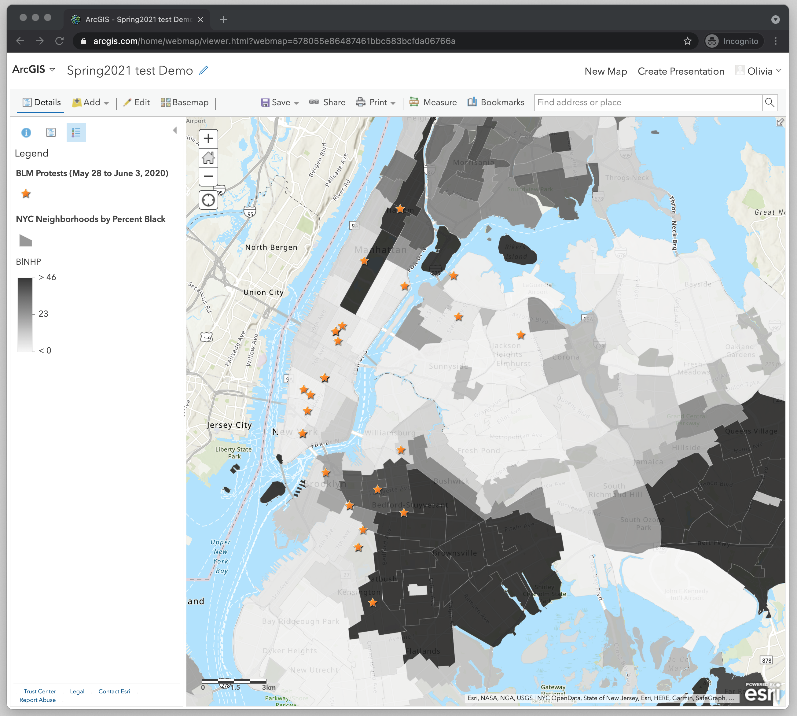

# 1. Introduction to Mapping

Making a map is like learning a new language, it’s a slow and frustrating process because there are a lot of concepts unique to mapping and almost none of it makes sense in the beginning. This first part of the workshop is a very quick overview of mapping concepts to help orient you to the process of mapmaking. 

In this map of the United States we see three basic shapes—the cities are represented by points, the main rivers are represented by lines and the states are represented by polygons. While this is a very simple map, most maps that you’ve seen, even the most intricate ones only consist of these three basic shapes--points, lines and polygons. This type of mapping data is called ‘vector data’. 

Sidebar: There is another important type of data that we will not be using in this workshop, but you should be aware of. It’s called ‘raster data.’ Raster data is an image, such as a satellite image, with ‘geolocations’--which just means location data. It’s beneficial to store geographic data as raster data when you are working with continuous data, such as heat or elevation. 

Voilà!

## Features and Attributes

Another mapping concept that’s important to know is that the visualizations that are displayed on the map are called the map’s ‘features’ and the data that’s connected to those shapes are called the maps ‘attributes.’ Attribute data is stored in an attribute table, which is a lot like spreadsheet. One feature on the map can contain many attributes--the feature for the state of Florida has the attributes “STATEFP” (the state ID), “STUSPS” (the state abbreviation), “NAME” (the state name), etc. Any type of data that you have at the scale of the state can be put in this attribute table. The attribute table stores all of the data and then you decide what data you want to visualize.  

# 2. Mapping Tools

There are a few questions to consider that will help you choose the right tool for mapping:

- Static or Interactive?
    - Do you want a static map, such as a high quality image that can be published? Or do you want an interactive web-based map?
- What is your budget?
    - Can you only rely on free tools or do you have some money to put towards your mapping project?
- What is your time commitment? 
    - Do you have the time to learn higher level mapping skills, which is better for doing a spatial analysis, or do you want a tool that can allow you to make a map quickly because you just want to visualize spatial data?
- Will you be working in a team? 
    - Might you need a shared platform for creating your map?

Both ArcGIS and QGIS are software that you download onto your computer and can be used to perform spatial operations (analyze and manipulate your data), and make composite maps. Here is a quick comparison of the two.

For this workshop we will be using QGIS to perform spatial operations on our data. This is because QGIS is free and open source! It’s one limitation is that it doesn’t offer a way to make interactive maps. ArcGIS does offer an online version that can be used to make interactive maps, but the limitation is that you need a paid subscription if you want to perform spatial operations. So for this workshop we’re going to do a little hack in which we use two different mapping tools so we can have a completely free experience :) We will use QGIS to perform spatial operations. And then we will export the data and upload it into ArcGIS Online to make our interactive map. 

Here is a quick comparison for some of the mapping software that you can use to make an interactive map. 

The only option that is truly free is Leaflet, but it requires familiarity with coding. You can read more about the benefits and limitations of these tools in [this article](<https://digitalfellows.commons.gc.cuny.edu/2019/06/03/finding-the-right-tools-for-mapping/>)

# 3. Ethics of Mapping

In introduction to mapping courses we are often told that every map starts with a lie--that the earth is flat. From the first step of having to choose a mapping projection and decide on which types of inaccuracies you would be willing to sacrifice, the process of mapping is filled with ethical choices. Over the years, many of these decisions have been obscured through a greater reliance on technology. Today, (far too many) mapmakers allow the software to make decisions for them. However, whether these are active or passive decisions, they are still decisions that affect the map and the viewers interpretation of the map.

Maps are powerful. The cartesian map which divides the world into coordinates has its origins as being a tool for nation-state building and colonialism. Due to this history, maps are often seen as authoritative and therefore representing objective Truth. Being a cartographer comes with a lot of responsibility. Still today, once you display something in the form of a map it’s rarely questioned for its veracity. And yet, the real Truth is that all maps only represent partial truths. 

So much of the mapping process is dependent on the positionality of the mapmaker and all of the subjective decisions that they must make when deciding what will be mapped, how the data will be manipulated, and how it will be visualized.

Important ethical decisions that every mapmaker must consider are:

- What data should I use?
    - If you choose to use data that’s already collected (e.g. Census data), are you using it because it’s the easiest to access or because it’s the most appropriate data to answer your research question? What are the limitations of using data that hasn’t been collected or managed by you? 
- How should I classify the data?
    - What categories will you create? For example, if you are working with racial demographics will you report on the categories such as Latinx, non-Latinx White, non-Latinx Black, Latinx White, Latinx Black, etc, or will you provide broader categories such as people of color and white. What are the implications of choosing more general categories? 
- At what resolution or scale should the data be aggregated?
    - If you are studying a phenomena at the neighborhood level, how do you define the boundaries of a neighborhood? Is it based on the school district, the CDP (Census Designated Place), the voting district, or maybe a boundary that doesnt have a formal delination, such as a sense of community among people?
    - What are the implications of aggregating the data at a certain scale? For example, let’s say you are studying the differences between urban and suburban areas. If you aggregate your data at the level of counties, what could be missing from that representation of the data? Is there something that is happening at the level of the neighborhood or town, that could be useful to answer your research question? This is not to say that the smallest scales are always the best to work with, but rather to suggest that when we aggregate data, we need to be aware of what distinctions we are hiding in the process. 
- What colors and symbols should I use?
    - Should you represent a population in red or blue? Red normally signals something that is alarming, while blue is a more neutral color. These subjective cartographic design decisions greatly impact viewer’s understanding of the map.

For more guiding questions on ethical decision making, please see [this robust resource](<https://serc.carleton.edu/geoethics/Decision-Making>) put together by “The Community of Earth Educators.”

With all of the subjective decisions that go into mapmaking, those working out the tradition of feminist GIS and critical cartography have stressed the importance of contextualizing one’s map. Maps should not speak for themselves. We should add context that allows the viewer to understand all of the decisions that were made while making the map. This form of transparency will help tell the story that you are trying to communicate. 

For more about the history of mapping, and to learn about current countermapping projects, see these resources:
- [Manual of Collective Mapping.](<https://www.academia.edu/28625755/Manual_of_Collective_Mapping_Critical_cartographic_resources_for_territorial_processes_of_collaborative_creation_2016_>) Critical cartographic resources for territorial processes of collaborative creation.
- [Counter Mapping:](<https://emergencemagazine.org/feature/counter-mapping/>) Zuni Maps

# 4. Making an Interactive Map Demo: Introduction

## Research Question

Do Black Lives Matter protests tend to take place more in majority Black neighborhoods, perhaps as a tactic to build solidarity, or in majority non-Black, perhaps as a tactic to raise awareness?

## Exploring the Data

What kind of data do we need to make this map?

- Location of protests.
    - Since this data didn’t exist, I had to create it. I tried to find all of the protests that took place from May 28, 2020 to June 3, 2020. Since this was based on my own ability to capture the data from news articles, I assume that there are protests that happened during that week that are not in my dataset. When I publish my map it would be important to state this assumption and include the methodology for how this data was collected.   
- Shapes to represent the neighborhoods.
    - For NYC neighborhoods we can download a shapefile (which is a form of spatial data) from NYC Open Data. The file can be downloaded here. Click on “Export” and select “Shapefile”.  A compressed folder will download. Move the folder out of your downloads and into a folder on your computer were you will be keeping all of the data for this workshop. 
    - When you open the folder you will notice there are 4 different files in there that all have the same name, yet are a different file type. In order for a shapefile to work, all of this data needs to stay together. Please zip the folder, so that the whole folder can be uploaded into our mapping software when we are ready to use it. 
- Census data on race by neighborhood
    - Census generated demographic data can be downloaded as a CSV file from the Census website. I’ve already downloaded the spreadsheet and cleaned it up for us so that it only has the variables that we are interested in--GeoName (neighborhood name), GeoID(a unique identifier for each neighborhood), and BINHP (Percent Black). 

To get a better idea of what we will be building together, you can see a final version of the [map here](<http://arcg.is/1KyC9O >). 

# 5. Combining Data Through a Spatial Join

When we think about how the data will be visualized in the map, we will be turning the location of the protests into a layer of points. And we will be stacking the point layer on top of a polygon layer, which are the neighborhoods. Since our neighborhood data--the features stored in the Shapefile and the CSV with the data on race--are in two separate files, we’ll need to perform a ‘spatial join’ to combine them into one file. 

## What’s a Spatial Join?

Well I’m glad you asked because a spatial join is one of the most common GIS operations! Since most of the data that we work with do not have coordinates attached to it (e.g. Census data), a spatial join is a way to connect data without mappable coordinates to features with mappable coordinates. 

In order to do this both files need to be the same resolution (e.g. NYC neighborhood) and they need to have a column of the same unique identifiers--this will serve as a key to match the two data files. When you work with data from the government, such at Census data, each geographical unit (e.g. each different neighborhood) will be given a unique identifier, so if both your data and your shapefile are from the government then the unique identifiers will match. 

## What will we use to do the Spatial Join?

We will use QGIS which is a free and open source mapping software that will allow us to do pretty much any spatial operation that you could ever want! If you haven’t yet installed QGIS you can do so by following these installation instructions **add link**. 

When you open QGIS, you’ll see an interface that looks like this:

# 6. Performing a Spatial Join

## Adding data to QGIS

First, open QGIS. Let’s add our data that needs to be joined. Follow the steps below to help you through the process.

1. To add our CSV of demographic data, “racebyneighborhood.csv”, open the **Data Source Manager**--this button is located in the top left and looks like three pieces of colored paper stacked on top of each other.

2. When the Data Source Manager is Open, select the **Delimited Text** option.
3. On the right side of the **File name** section, click on the three dots to locate the file. Then click **Add**.

You should now see the file appear in your Layers panel. You’ll also see that nothing happens in your map display panel; this is because a CSV file is not mappable. That’s why we need to combine it with our shapefile of vector data. 

Now let’s add our shapefile of NYC 
1. Go back to the **Data Source Manager** and this time select **Vector**. 
2. Under **Source type** the “file” option should be selected. 
3. Where it says **Vector datasets**, use the browse feature again to find the shapefile on your computer and click **Add**. 

Now you should see that the file shows up in your Layers Panel, and it also displays as a map layer on your display panel. 

## Looking at the Attribute Table

Let’s look at the data in the attribute table to see what we’re working with. Each file has its own attribute table, so let’s look at them one at a time. 

1. Right click on the “racebyneighborhood” file and select Open attribute table.
    - If you see the three variables--GeoName, GeoID, and BINHP--then we’re good to go! 

Let’s open the attribute table for the “Neighborhood Tabulation Area” shapefile. 
1. Right click on that layer and select Open attribute table. 
    - In this table you will see the variables: boro_code (borough code), boro_name (borough name), county_fip (the county unique identifier), ntacode (the unique identifier for each neighborhood), ntaname (neighborhood name), shape_area (Surface area of each neighborhood in decimal degrees) and shape_leng (The length of the perimeter of each neighborhood in decimal degrees).

You will notice that both files have a variable in common--the “ntacode” in the shapefile is the same as the “GeoID” in the CSV file. These two variables will serve as our keys that will be used to match and join the files together. 

A spatial join won’t work unless the fields are the same type--integer, double, string, etc. To see the field type, double-click on each layer and navigate to the “Fields” tab. The ‘ntacode’ and the ‘GeoId’ are both string variables, so we are all set for our join. 

## Performing a Spatial Join

Now we are ready for our spatial join!

1. In the layers panel, double click on the shapefile layer, “Neighborhood Tabulation Area”.Then click on **Joins** and click on the **green plus sign**. A new box will pop up. This is where you will configure your spatial join. 
    - The **Join layer** should be “racebyneighborhood” since that is the map layer you are joining to the neighborhood shapefile. 
    - The **Join field** should be “GeoID.”
    - The **Target field** should be “ntacode.”
    - Note: “GeoID” and “nta code” are the two variables that match from the two mapping layers. This is why we are using them here as the **Join field** and **Target field**.
    - Where it says **Custom Field Name Prefix** you can click the checkbox and change the prefix. This prefix will be added to the variable name of every join layer. You can change it to something shorter or you can simply delete the text so no prefix is added. I’m going to delete mine.
    - Lastly, click **OK** to save the configuration of the spatial join. 
    - To run the join, click **OK**.

To check to see if the join was successful, we’ll need to look at the neighborhood shapefile’s attribute table and see if the variables from the CSV file are there. 
1. Right click on the shapefile layer and select **Open attribute table**. If you scroll to the right you should see the three variables from the CSV file--”GeoName”, “GeoID”, and “BINHP”. If you see them, then you’ve successfully completed a spatial join! 

Since our shapefile layer has been updated with new data, lets rename it.
1. Right click on the shapefile layer in the Layers Panel and select **Rename**. I’m going to rename mine “NYCntaPerBlack.” This name will let me know that the data has New York City neighborhood tabulation areas and percent black. 

**Note**: Mapping softwares typically offer two different types of spatial joins--join by attribute and join by location. **Join by attribute** is the type of join what we just did; it’s based on matching two layers based on a shared attribute or variable. **Join by location** is when you have two shapefiles that you want to combine based on where the features are located on the map. For example if you have a map of US states and you want to add information about its cities, you can run a spatial join by location. To learn more about this type of join, check out [this article.](<https://gisgeography.com/spatial-join/>) 

## Exporting Data from QGIS

Now our neighborhood shapefile (with the demographic information in it) is ready to be exported from QGIS and uploaded into ArcGIS Online where we will be able to turn it into an interactive map. 

Before we export the shapefile file, let’s create a folder for it. Since shapefiles are actually a set of 4-6 files, it’s helpful to create a folder for them so they don’t get mixed up with your other files. 

1. Create a new folder somewhere on your computer where you are keeping the data for this workshop. 
2. Let’s name the folder “NYCntaPerBlack.”

Now we’re ready to export the data.
1. In QGIS, right click on the neighborhood shapefile in the Layers panel. Then select **Export** and **Save Features As**.
2. Under **File name** we need to tell QGIS which folder to export the file into. Use the three dots to navigate to the folder “NYCntaPerBlack” 
3. Next, you can click off the check box at the very bottom of the “Save Vector Layer as…” configuration box, where it says **Add saved file to map**. Since we already have this as a map layer in QGIS, there’s no need to add it as another layer in the software. 
4. You can leave everything else in the configuration alone. Lastly, click **OK** to complete exporting the data. 

Navigate to your “NYCntaPerBlack” folder and check to see if all of the shapefiles are in there. If they are, then your export was successful. 

The last thing we have to do is **zip or compress** the folder. ArcGIS Online will only import zipped shapefiles. If you’re working on a Mac, right click on the “NYCntaPerBlack” folder and click **compress**. If you’re on a PC, right click on the “NYCntaPerBlack” folder and select Send to and then **Compressed (zipped) folder**.

# 6. Importing data to ArcGIS Online

First, you’ll have to set yourself up with a free ArcGIS Online public account.

1. Open ArcGIS Online: https://www.arcgis.com/home/index.html , and Sign in. If you don’t have an account, you can create one for free or use your Google, Facebook or Github account.

Once you’ve logged in let’s open a new map project. 

1. Select “Map” in the main menu.

Let’s get acquainted with the interface. 

Now let’s import and format our neighborhoods shapefile.

1. Click on **Add**.
2. Click **Add Layer from File**. 
3. Select **Choose File**. And navigate to where you have the zipped/compressed “NYCntaPerBlack” file saved on your computer.
4. Feel free to leave the option “Generalize features for web display” selected. I’ve tried making maps with both this option and “Keep original features” and I’ve never noticed any difference. 
 5. Click **Import Layer**.

You should now see something that looks like a map of New York City, colored in by the Borough or another attribute. ArcGIS automatically selects an attribute to use to show on the map. 

# 7. Changing the Map Style

Let’s change the attribute so that it shows the percent Black population of New York City’s neighborhoods.

1. Under **Choose an attribute to show**, select “BINHP” which stands for Black Non-Hispanic Population. 
2. Click around with the Drawing Styles to see which you think works best. 
3. For this demo, let’s use the first option, which is a choropleth map style that shows the value by the intensity of the color. 
4. Let’s change the color to something different. 
    - In the **Counts and Amounts** (Color) box click **Options**. 
    - Click **Symbols**, and change the color. I’m selecting the black/white color ramp since I think it fits in with the story I’m trying to tell. 
    - Once you’ve chosen your color ramp, click **OK**. 
    - Optional: You can click on **Classify** if you want to change how the data is visualized and how many categories are created. “Natural breaks” is a good option because it increases variability between classes while decreasing it within classes. 
    - Click the **OK** button at the bottom of the Layers Panel. 
    - Finally, click **Done** to save your changes to the map. If you don’t click Done, it will revert to what you had before. 

You should now see your maps styled with your new color ramp. You’ll also see the “NYCntaPerBlack” map layer in the Layers Panel. And if you click on your map you’ll see a pop-up with all of the information contained in the attribute table.

# 8. Configuring the Pop-up

As you’ll see, the pop-up doesn’t look very nice. The names won’t make much sense to the map viewer, and the viewer probably wouldn’t be interested in information like the “nta code”. Let’s configure our pop-up so that it looks better.

1. In the map Layers Panel, **hover over** where it has the name of the shapefile “NYCntaPerBlack”, and you will see some options appear below it--”show legend”, “show table”, “change style”, and “more options.”
2. Select **More options** (this is the three dots below the name of the map layer).
3. Select **Configure Pop-up**. The Layers Panel will turn into a panel for configuring the pop-up. 

Let’s explore the options that we have for the pop-up. 

1. The first thing you’ll see is a checkbox for turning on and off the pop-up. We’re going to leave ours on. 
2. In the **Pop-up Title**, you can enter a name that will be displayed at the top of every pop-up box. You can type in something. Or you can have one of the attributes displayed. Let’s have the neighborhood name displayed in the pop-up title. To do this, **click the plus sign** to the right of the text box and select “ntaname”. Next to “ntaname” write “( Black%). So now the title will show the name of the neighborhood and the text “(Black%)”. 
3. In the **Display**, select the drop down to see the list of options. The options for what you can display in the pop-up are “A list of attributes”, “A description from one field”, “A custom attribute display”, and “no attribute information”. We are going to select **A description from one field** since we are only interested in showing the value for Percent Black. Then in the next drop down **select “BINHP”**.
4. Then click OK to save our changes. 

Now when you click on the map you should see a popup with just the name of the neighborhood plus the text (Black%) and then in the box you will see the value for Percent Black. 

# 9. Importing CSV file and Geocoding Addresses

Now we’re ready to import our next mapping layer. This one will be the CSV file that we have of several BLM protests that took place during one week in June. We want to layer this data as points on our choropleth map in order to see if the protests tended to take place in neighborhoods that were majority Black, or not. 

Let’s import the file.

1. Select **Add**.
2. Select **Add Layer from File**. 
3. Select **Choose File**, and navigate to where you have the file “1 Week of Protests.csv” saved on  your computer. 
4. Select **Import Layer**.

At this point a box should appear that says “Add CSV Layer” at the top and has information about location, coordinates and addresses. This is the mapping softwares way of asking you if you want to convert the addresses that are stored in the CSV file into points on the map. This process is called “geocoding.” Geocoding will only work if you have addresses or coordinates stored in your CSV file, and luckily we do! If you open the CSV file in a spreadsheet manager, you’ll see that we have the fields “address”, “city”, “state” and “zip”. This is all the geocoder will need to be able to locate the address for each protest and create a map layer of points. 

To geocode the CSV file, the **Field Name** column (pulled from the CSV file) needs to match with the **Location Fields** column (which is the geocoder column). Make sure that the following fields match:

1. Field Name: Address  =  Location Fields: Address or Place
2. Field Name: City  =  Location Fields: City
3. Field Name: State =  Location Fields: State
4. Field Name: Zip  =  Location Fields: Zip

If they don’t match, then click on the cell(s) to change it. Most likely, since the mapping software is pretty good at this stuff, they will all be automatically matched, so you won’t have to change anything. Finally, click **Add Layer**.

Note: ArcGIS will only geocode up to 100 entries. If you have more than 100 then you can use the Census Geocoder, which geocodes up to 1000 entries

# 10. Changing the Style of the Points Layer

Now you should see a series of points on top of the neighborhood map layer. ArcGIS Online will automatically choose an attribute to use to style the point layer. In my example it chose “Start location.” 

Let’s change the style of the points layer. I’m not really interested in displaying any particular attribute along with the protests. I just want to see the location of the protests. 
1. Under **Choose an attribute to show**, select “Show location only.”
2. Now let’s change the color of the points. In the box that says Location (single symbol) choose **OPTIONS**. 
3. Select Symbols. 
4. Feel free to play around with the options for the style of the point. You can change the shape, the fill color, the outline, and the size. You can even upload your own image. For mine, I chose an orange star that’s size 12.
5. Select **OK**.
6. And select **OK** again.
7. Finally, select **DONE** to save your changes.  

With this map we should already be able to answer our research question. We wanted to know if there might be a relationship between the location of BLM protests and the racial demographic of the neighborhood, specifically if the neighborhood is majority Black. Here we can already see little correlation between the location of the protests and the racial demographic of the neighborhood. We can observe, however, that many of the protests are taking place in centrally located places in Manhattan and in some parts of Brooklyn. If we start clicking on the points we’ll also see that many of the location starting points are popular sites and meeting places, such as Times Square, Union Square, and Bryant Park. 

# 11. Formatting the Pop-ups for the Protest Locations

Let’s format the pop-ups for the protest locations so that the map viewer can learn more about the sites. The attributes that can be displayed are: “Date”, “Start Location”, “Address”, “City”, “State”, “Zip”, “Photo”,	“Details”. 

Out of these options, let’s display the “Start location”, “photo” and “details.”

1. In the **Map Layers Panel**, hover over where it has the name of the points layer “1 Week of Protest” and select the three dots for **More Options**. Then select **Configure Pop-up**.
2. In **Pop-up Title** write “BLM Protest”
3. In **Display** select “A list of field attributes.”
4. Select **Configure Attributes**. 

Now you should see a place where you can decide which attributes to display by clicking the checkboxes under the **Display** column. You can also edit the **TextBox Type** by having the checkboxes under the **Edit** column selected. Lastly, you can change the name that appears for the attribute in the pop-up. To do this click on the words in the column **Field Alias** and it will allow you to put in new text. Let’s try some of these options.

1. In the **Display** column select “Start Location” and “Details.” Even though we also want to add “photo” we are not going to check that off here. Media needs to be configured through a different process, which we’ll do next. 
2. You don’t have to change anything in the **Edit** column. 
3. Under Field Alias click on the word “Details” and change it to “Protest info.”
4. Click OK.

Now let’s add our photo to the pop-up.

1. Under **Pop-up Media** select **Add < Image**. 
2. In **Title** delete the text and leave it blank.
3. Leave the Caption blank.
4. For the **URL**, click the plus sign and select “Photo”. You might have to scroll down to find it in the list of attributes. 
5. Click **OK**.

Click **OK** again to save your changes. 

Now you should see a nicer looking pop-up when you click on the points on your map. Some points don’t have any “Protest info”, but for all of them you should see the “Start location” and photo. 

# 12. Formatting the Legend 
Let’s have a quick look at the legend to make sure that it will be informative for our map viewer. 

1. In the Map Layers Panel, at the top you should see three icons--an “i” with a blue circle around it, followed by a paper with blue writing, and then a bulleted list. Click on the icon that looks like a bulleted list; that's the legend icon. 
2. I think the legend generally looks okay, but it’s displaying the name of the map layer, which can be a little confusing for the viewer, especially the layer “NYCntaPerBlack.” Let’s rename the layers to it will be easier for the viewer to understand.
3. Go back to the Map Layer panel where you can see the hyperlinked layers. You can do this by clicking the icon that looks like a white sheet of paper with blue writing.
4. Then click on the three dots for **More Options** and select **Rename**.
5. Do this for both layers to rename them something that's easier to read. I’m going to name mine “BLM Protests (May 28 to June 3, 2020)” and “NYC Neighborhoods by Percent Black.”

# 13. Saving and Sharing Your Map

Now it’s finally time to save and share your map!

1. To save the map, click the **Save** button (with the floppy disk icon). Enter your title, tags, and summary to describe the map. Then click **Save Map**.

2. To share your map, click on the **Share** button (with the chain link icon). 
3. Click the checkmark next to **Everyone (public)** so that you can share the map with the public. Once you do that, all of the share options will become available to you, including sharing the URL to the map or getting embed code to put the map on a website. 

Congratulations! You’ve made a pretty cool interactive map with two layers of spatial data, multiple pop-ups, and even multimedia with your pop-ups!

## Challenge: Here you can put a title

Paragraph... image... whatever you want. subtitle..

## (Optional) Solution

Paragraph.. image... subtitle..

## (Optional) Evaluation

Multi-choice question/open-ended question/single-choice question formulated as a question?
- choice 1
- choice 2*
- choice 3
- choice 4*

## (Optional) Keywords

Do you remember the glossary terms from this section?

- Term
- Term
- Term
- [Term](https://github.com/DHRI-Curriculum/glossary/blob/v2.0/terms/term-file.md)

# Title (for lesson 2)

....
