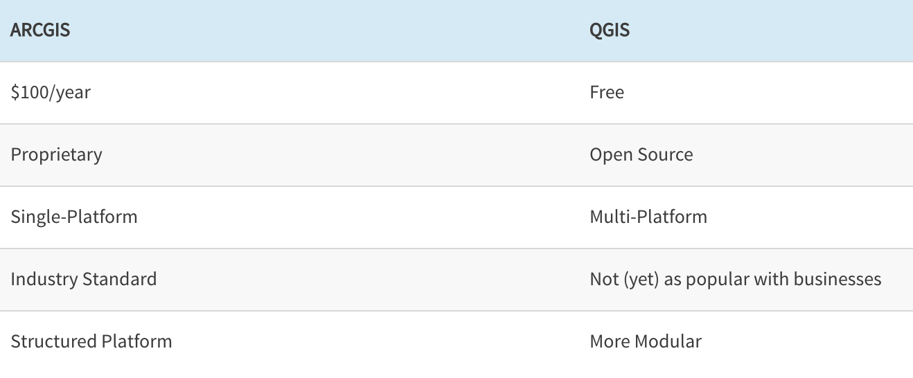
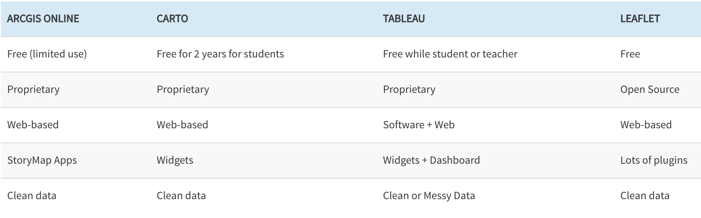

← [Introduction to Mapping](01-introduction-to-mapping.md)&nbsp;&nbsp;&nbsp;|&nbsp;&nbsp;&nbsp;[Ethics of Mapping](03-ethics-of-mapping.md) →

---

# 2. Mapping Tools

There are a few questions to consider that will help you choose the right tool for mapping:

- **Static or Interactive?** Do you want a static map, such as a high quality image that can be published? Or do you want an interactive web-based map?
- **What is your budget?** Can you only rely on free tools or do you have some money to put towards your mapping project?
- **What is your time commitment?** Do you have the time to learn higher level mapping skills, which is better for doing a spatial analysis, or do you want a tool that can allow you to make a map quickly because you just want to visualize spatial data?
- **Will you be working in a team?** Might you need a shared platform for creating your map?

Both ArcGIS and QGIS are software that you download onto your computer and can be used to perform spatial operations (analyze and manipulate your data), and make composite maps. Here is a quick comparison of the two.

For this workshop we will be using QGIS to perform spatial operations on our data. This is because QGIS is free and open source! It's one limitation is that it doesn't offer a way to make interactive maps. ArcGIS does offer an online version that can be used to make interactive maps, but the limitation is that you need a paid subscription if you want to perform spatial operations. So for this workshop we're going to do a little hack in which we use two different mapping tools so we can have a completely free experience :) We will use QGIS to perform spatial operations. And then we will export the data and upload it into ArcGIS Online to make our interactive map.

Here is a quick comparison for some of the mapping software that you can use to make an interactive map.

The only option that is truly free is Leaflet, but it requires familiarity with coding. You can read more about the benefits and limitations of these tools in [this article](https://digitalfellows.commons.gc.cuny.edu/2019/06/03/finding-the-right-tools-for-mapping/).

---

← [Introduction to Mapping](01-introduction-to-mapping.md)&nbsp;&nbsp;&nbsp;|&nbsp;&nbsp;&nbsp;[Ethics of Mapping](03-ethics-of-mapping.md) →