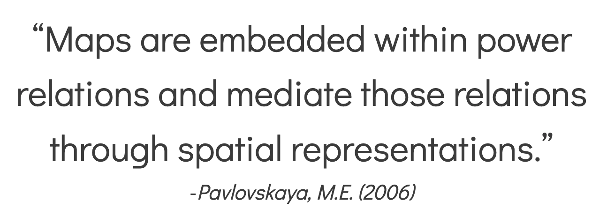

← [Mapping Tools](02-mapping-tools.md)&nbsp;&nbsp;&nbsp;|&nbsp;&nbsp;&nbsp;[Ethics of Mapping Continued: Questions to Consider](04-ethics-of-mapping-continued-questions-to-consider.md) →

---

# 3. Ethics of Mapping

In introduction to mapping courses we are often told that every map starts with a lie—that the earth is flat. From the first step of having to choose a mapping projection and decide on which types of inaccuracies you would be willing to sacrifice, the process of mapping is filled with ethical choices. Over the years, many of these decisions have been obscured through a greater reliance on technology. Today, (far too many) mapmakers allow the software to make decisions for them. However, whether these are active or passive decisions, they are still decisions that affect the map and the viewers interpretation of the map.

Maps are powerful. The cartesian map which divides the world into coordinates has its origins as being a tool for nation-state building and colonialism. Due to this history, maps are often seen as authoritative and therefore representing objective Truth. Being a cartographer comes with a lot of responsibility. Still today, once you display something in the form of a map it's rarely questioned for its veracity. And yet, the real Truth is that all maps only represent partial truths.

So much of the mapping process is dependent on the positionality of the mapmaker and all of the subjective decisions that they must make when deciding what will be mapped, how the data will be manipulated, and how it will be visualized.

---

← [Mapping Tools](02-mapping-tools.md)&nbsp;&nbsp;&nbsp;|&nbsp;&nbsp;&nbsp;[Ethics of Mapping Continued: Questions to Consider](04-ethics-of-mapping-continued-questions-to-consider.md) →