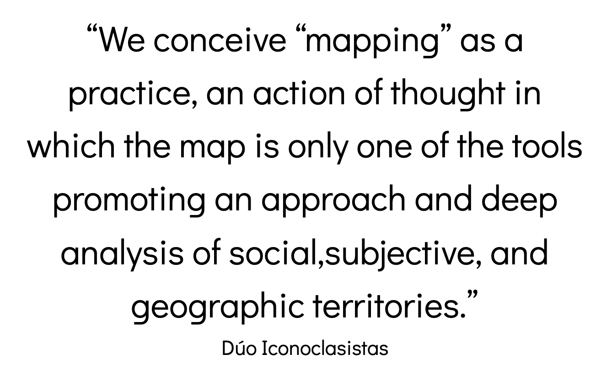

← [Mapping Tools](02-mapping-tools.md)&nbsp;&nbsp;&nbsp;|&nbsp;&nbsp;&nbsp;[Making an Interactive Map Demo: Introduction](04-making-an-interactive-map-demo-introduction.md) →

—-

# 3. Ethics of Mapping

In introduction to mapping courses we are often told that every map starts with a lie—that the earth is flat. From the first step of having to choose a mapping projection and decide on which types of inaccuracies you would be willing to sacrifice, the process of mapping is filled with ethical choices. Over the years, many of these decisions have been obscured through a greater reliance on technology. Today, (far too many) mapmakers allow the software to make decisions for them. However, whether these are active or passive decisions, they are still decisions that affect the map and the viewers interpretation of the map.

Maps are powerful. The cartesian map which divides the world into coordinates has its origins as being a tool for nation-state building and colonialism. Due to this history, maps are often seen as authoritative and therefore representing objective Truth. Being a cartographer comes with a lot of responsibility. Still today, once you display something in the form of a map it's rarely questioned for its veracity. And yet, the real Truth is that all maps only represent partial truths. 

So much of the mapping process is dependent on the positionality of the mapmaker and all of the subjective decisions that they must make when deciding what will be mapped, how the data will be manipulated, and how it will be visualized.

Important ethical decisions that every mapmaker must consider are:

- What data should I use?
    - If you choose to use data that's already collected (e.g. Census data), are you using it because it's the easiest to access or because it's the most appropriate data to answer your research question? What are the limitations of using data that hasn't been collected or managed by you? 
- How should I classify the data?
    - What categories will you create? For example, if you are working with racial demographics will you report on the categories such as Latinx, non-Latinx White, non-Latinx Black, Latinx White, Latinx Black, etc, or will you provide broader categories such as people of color and white. What are the implications of choosing more general categories? 
- At what resolution or scale should the data be aggregated?
    - If you are studying a phenomena at the neighborhood level, how do you define the boundaries of a neighborhood? Is it based on the school district, the CDP (Census Designated Place), the voting district, or maybe a boundary that doesnt have a formal delination, such as a sense of community among people?
    - What are the implications of aggregating the data at a certain scale? For example, let's say you are studying the differences between urban and suburban areas. If you aggregate your data at the level of counties, what could be missing from that representation of the data? Is there something that is happening at the level of the neighborhood or town, that could be useful to answer your research question? This is not to say that the smallest scales are always the best to work with, but rather to suggest that when we aggregate data, we need to be aware of what distinctions we are hiding in the process. 
- What colors and symbols should I use?
    - Should you represent a population in red or blue? Red normally signals something that is alarming, while blue is a more neutral color. These subjective cartographic design decisions greatly impact viewer's understanding of the map.

For more guiding questions on ethical decision making, please see [this robust resource](https://serc.carleton.edu/geoethics/Decision-Making) put together by "The Community of Earth Educators."

With all of the subjective decisions that go into mapmaking, those working out the tradition of feminist GIS and critical cartography have stressed the importance of contextualizing one's map. Maps should not speak for themselves. We should add context that allows the viewer to understand all of the decisions that were made while making the map. This form of transparency will help tell the story that you are trying to communicate. 

For more about the history of mapping, and to learn about current countermapping projects, see these resources:
- [Manual of Collective Mapping.](https://www.academia.edu/28625755/Manual_of_Collective_Mapping_Critical_cartographic_resources_for_territorial_processes_of_collaborative_creation_2016_) Critical cartographic resources for territorial processes of collaborative creation.
- [Counter Mapping:](https://emergencemagazine.org/feature/counter-mapping/) Zuni Maps

—-

← [Mapping Tools](02-mapping-tools.md)&nbsp;&nbsp;&nbsp;|&nbsp;&nbsp;&nbsp;[Making an Interactive Map Demo: Introduction](04-making-an-interactive-map-demo-introduction.md) →