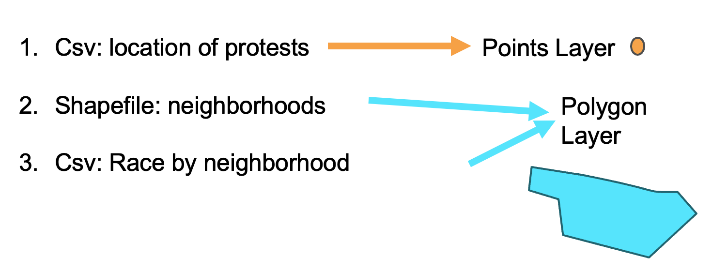

← [Making an Interactive Map: Introduction](05-making-an-interactive-map-introduction.md)&nbsp;&nbsp;&nbsp;|&nbsp;&nbsp;&nbsp;[Performing a Spatial Join](07-performing-a-spatial-join.md) →

---

# 6. Combining Data Through a Spatial Join

Since our neighborhood data are in two separate files, we'll need to perform a "spatial join" to combine them into one file. During the spatial join we will add the data on percent black by neighborhood that's in our CSV to the neighborhood shapefile, which is a polygon layer. Remember that only vector data (points, lines and polygons) or raster data (pixels) is geographic data. Also, remember that vector data is typically stored as a shapefile, so when you have a shapefile, you know it's geographic data. A CSV is not geographic data, even if it might have geographic data in it, such as addresses. A CSV is a text file, so it needs to be combined with geographic data to be visualized on a map. This is why we will need to use a *spatial join*.

## What's a "Spatial Join"?

Well, I'm glad you asked because a [*spatial join*](https://github.com/DHRI-Curriculum/glossary/blob/v2.0/terms/spatialjoin) is one of the most common GIS operations! There are two types of spatial joins--*spatial join by attribute* and *spatial join by location*. Both of them are ways that the mapping software will let you add data from one map layer or file to another map layer. A *spatial join by attribute* is used when you want to join non-spatial data, such as a text file, to spatial data, such as a shapefile. A *spatial join by location* is used when you want to join two layers of spatial data (e.g. a points layer to a polygon layer). Let's say you are working with the map of the U.S. used in the introduction and you want to aggregate information at the city level (the point layer) to the level of the state (the polygon layer). For this you will use a *join by location* since you are comparing two layers with spatial data.

Since we are joining a CSV file (non-spatial data) with a shapefile (spatial data) we will need to use a *join by attribute*.

In order to do this both files need to be the same resolution (e.g. NYC neighborhood). A [resolution](https://github.com/DHRI-Curriculum/glossary/blob/v2.0/terms/resolution.md) is the scale at which the data is aggregated and displayed. Additionally, both files need to have a column with the same unique identifiers—this will serve as a key to match the two data files. When you work with data from the government, such at Census data, each geographical unit (e.g. each different neighborhood) will be given a unique identifier, so if both your data and your shapefile are from the government then the unique identifiers will match.

Now that we have the concepts for what a spatial join means, we can move on to performing the spatial join on our data.

## Evaluation

A spatial join by attribute is used when you want to join which combination of layers:
- spatial data to non-spatial data*
- spatial data to spatial data

## Keywords

Do you remember the glossary terms from this section?

- [Spatial Join](https://github.com/DHRI-Curriculum/glossary/blob/v2.0/terms/spatialjoin) 
- [Polygon layer](https://github.com/DHRI-Curriculum/glossary/blob/v2.0/terms/polygon.md)
- [Resolution](https://github.com/DHRI-Curriculum/glossary/blob/v2.0/terms/resolution.md)

---

← [Making an Interactive Map: Introduction](05-making-an-interactive-map-introduction.md)&nbsp;&nbsp;&nbsp;|&nbsp;&nbsp;&nbsp;[Performing a Spatial Join](07-performing-a-spatial-join.md) →