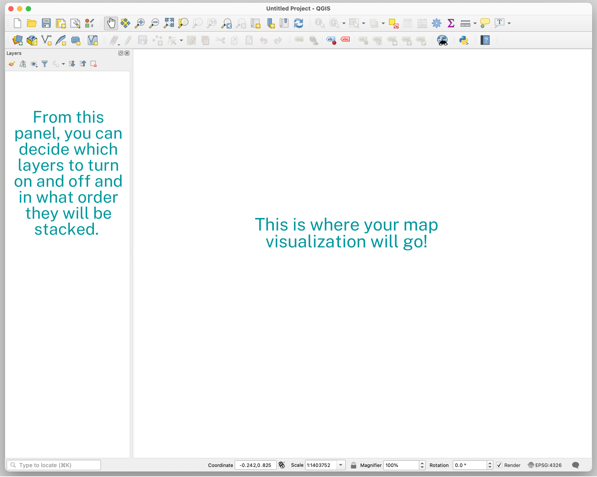
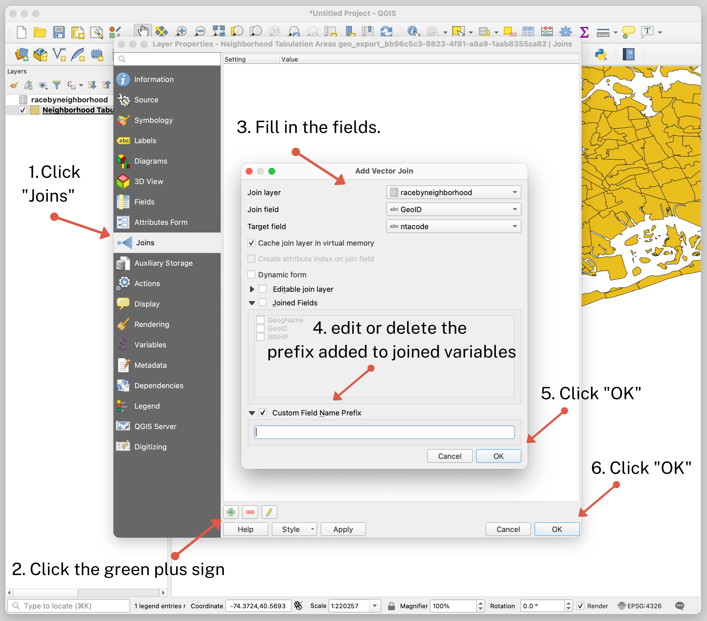

← [Combining Data Through a Spatial Join](05-combining-data-through-a-spatial-join.md)&nbsp;&nbsp;&nbsp;|&nbsp;&nbsp;&nbsp;[Exporting Data from QGIS](07-exporting-data-from-qgis.md) →

---

# 6. Performing a Spatial Join

We will use QGIS which is a free and open source mapping software that will allow us to do pretty much any spatial operation that you could ever want! If you haven't yet installed QGIS you can do so by following these installation instructions **add link**.<!-- TODO: add link to instructions here + build a file for it... -->

## Open QGIS

First, go ahead and open QGIS. When you open the application, you'll see an interface that looks like this:

## Adding Demographic Data to QGIS

Let's add our data that needs to be joined. Follow the steps below to help you through the process.

1. To add our CSV of demographic data, `racebyneighborhood.csv`, open the **Data Source Manager**—this button is located in the top left corner of the interface and looks like three pieces of colored paper stacked on top of each other.<!-- todo: add link to csv from glossary -->
2. When the Data Source Manager is open, select the **Delimited Text** option.
3. On the right side of the **File name** section, click on the three dots to locate the file. Then click **Add**.

You should now see the file appear in your Layers panel. You'll also see that nothing happens in your map display panel; this is because a CSV file is not mappable. That's why we need to combine it with our shapefile of vector data.

## Adding Vector Data from Our Shapefile to QGIS

Now let's add our shapefile of NYC:

1. Go back to the **Data Source Manager** and this time select **Vector**.
2. Under **Source type**, the "file" option should be selected.
3. Where it says **Vector datasets**, use the browse feature again to find the shapefile on your computer and click **Add**.

Now you should see that the file shows up in your Layers Panel, and it also displays as a map layer on your display panel.

## Inspecting the Attribute Table

Let's look at the data in the attribute table to see what we're working with. Each file has its own attribute table, so let's look at them one at a time.  To do so, right-click on the `racebyneighborhood.csv` file and select "Open attribute table." _If you see the three variables—`GeoName`, `GeoID`, and `BINHP`—then we're good to go!_

Let's open the attribute table for the "Neighborhood Tabulation Area" shapefile. Right-click on that layer and select "Open attribute table."

<!-- todo: add a screenshot here perhaps of what the attribute table looks like? -->

In the table, you will see the variables: `boro_code` (borough code), `boro_name` (borough name), `county_fip` (the unique identifier for each county), `ntacode` (the unique identifier for each neighborhood), `ntaname` (neighborhood name), `shape_area` (surface area of each neighborhood in decimal degrees) and `shape_leng` (the length of the perimeter of each neighborhood in decimal degrees).

You will notice that both files have a variable in common—the `ntacode` in the shapefile is the same as the `GeoID` in the CSV file. These two variables will serve as our keys that will be used to match and join the files together.

A spatial join won't work unless the fields are the same type—integer, double, string, etc. To see the field type, double-click on each layer and navigate to the "Fields" tab. The `ntacode` and the `GeoID` are both string variables, so we are all set for our join.<!-- todo: add link to data type from glossary -->

## Performing a Spatial Join

Now we are ready for our spatial join!

1. In the layers panel, double click on the shapefile layer, "Neighborhood Tabulation Area".Then click on **Joins** and click on the **green plus sign**. A new dialog will appear on the screen. This is where you will configure your spatial join.
2. Select `racebyneighborhood` for the **Join layer** option since that is the map layer you are joining to the neighborhood shapefile.
3. Select `GeoID` for the **Join field** option.
4. The **Target field** should be `ntacode`.
5. Where it says **Custom Field Name Prefix**, you can click the checkbox and change the prefix. This prefix will be added to the variable name of every join layer. You can change it to something shorter or you can simply delete the text so no prefix is added. I'm going to delete mine.
6. Lastly, click **OK** to save the configuration of the spatial join.
7. To run the join, click **OK** in the following dialog.

_Note: `GeoID` and `ntacode` are the two variables that match from the two mapping layers. This is why we are using them in step 3 and 4 above as the **Join field** and **Target field**._

To check to see if the join was successful, we'll need to look at the neighborhood shapefile's attribute table and see if the variables from the CSV file are there.

Right-click on the shapefile layer and select **Open attribute table**. If you scroll to the right you should see the three variables from the CSV file—`GeoName`, `GeoID`, and `BINHP`. If you see them, then you've successfully completed a spatial join!

Since our shapefile layer has been updated with new data, lets rename it. To do so, right-click on the shapefile layer in the Layers Panel and select **Rename**. I'm going to rename mine `NYCntaPerBlack`. This name will let me know that the data has New York City neighborhood tabulation areas and percent black.

## Note: Two Different Types of Spatial Joins

Mapping softwares typically offer two different types of spatial joins—join by attribute and join by location.

- **Join by attribute** is the type of join what we just did; it’s based on matching two layers based on a shared attribute or variable.
- **Join by location** is when you have two shapefiles that you want to combine based on where the features are located on the map. For example if you have a map of US states and you want to add information about its cities, you can run a spatial join by location. To learn more about this type of join, check out [How Spatial Join Works in GIS by GIS Geography](https://gisgeography.com/spatial-join/).

---

← [Combining Data Through a Spatial Join](05-combining-data-through-a-spatial-join.md)&nbsp;&nbsp;&nbsp;|&nbsp;&nbsp;&nbsp;[Exporting Data from QGIS](07-exporting-data-from-qgis.md) →