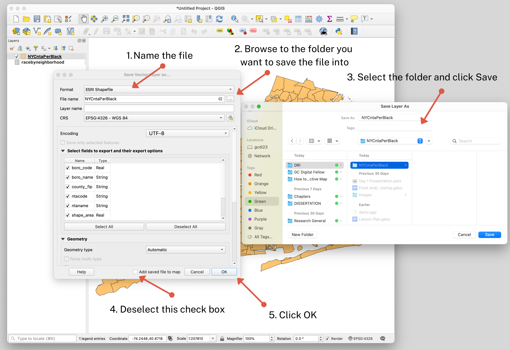

← [Performing a Spatial Join](07-performing-a-spatial-join.md)&nbsp;&nbsp;&nbsp;|&nbsp;&nbsp;&nbsp;[Importing Data to ArcGIS Online](09-importing-data-to-arcgis-online.md) →

---

# 8. Exporting Data from QGIS

Now our neighborhood shapefile (containing the demographic information) is ready to be exported from QGIS and uploaded into [ArcGIS Online](https://www.arcgis.com/home/index.html) where we will be able to turn it into an interactive map.

## Exporting the Data

1. In QGIS, right-click on the neighborhood layer in the Layers panel. Then select **Export** and **Save Features As**. Make sure the save file format is GeoJSON.
2. Under **File name** we need to tell QGIS which folder to export the file into. Use the three dots to navigate to your working folder.
3. Next, you can click off the check box at the very bottom of the "Save Vector Layer as…" configuration box, where it says **Add saved file to map**. Since we already have this as a map layer in QGIS, there's no need to add it as another layer in the software.
4. You can leave everything else in the configuration alone. Lastly, click **OK** to complete exporting the data.

Navigate to your working folder and check to see if the GeoJSON file you just exported is there. If it is, then your export was successful.

## Extra information: If you decide to export the layer as a Shapefile

If you decide to export the layer as a Shapefile, make sure you save all the files that make up the Shapefile in a folder and then compress it into a Zip file. Shapefiles are actually 4-6 files, so this helps keep them organized and prevent accidentally separating them. Also, ArcGIS will only import compressed shapefiles, so we need to create a folder to compress or zip the file.

---

← [Performing a Spatial Join](07-performing-a-spatial-join.md)&nbsp;&nbsp;&nbsp;|&nbsp;&nbsp;&nbsp;[Importing Data to ArcGIS Online](09-importing-data-to-arcgis-online.md) →