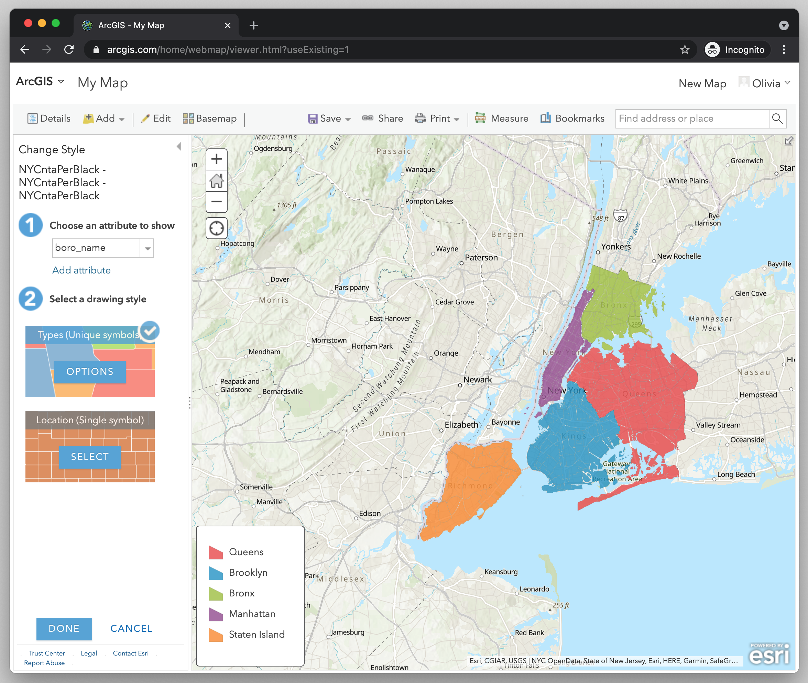

← [Exporting Data from QGIS](07-exporting-data-from-qgis.md)&nbsp;&nbsp;&nbsp;|&nbsp;&nbsp;&nbsp;[Changing the Map Style](09-changing-the-map-style.md) →

---

# 8. Importing Data to ArcGIS Online

<!-- TODO: add transitional short paragraph here about ArcGIS, reminding the learner what the difference is (and that there is a difference) between QGIS and ArcGIS -->

## Login to ArcGIS Online and Setup Interface

First, you'll have to set yourself up with a free ArcGIS Online public account. To do so, open [ArcGIS Online](https://www.arcgis.com), and click "Sign in." If you don't already have an account, you can create one for free using your email, or your Google, Facebook or Github account.

Once you've logged in, let's open a new map project by selecting "Map" in the main menu.

Let's get acquainted with the interface.

## Create a New Map and Add Your Data from QGIS to ArcGIS

Now, let's import and format our neighborhoods shapefile.

1. Click on **Add**.
2. Click **Add Layer from File**.
3. Select **Choose File**. Then navigate to where you have the compressed `NYCntaPerBlack` file saved on your computer.
4. Feel free to leave the option "Generalize features for web display" selected. I've tried making maps with both this option and "Keep original features" and I've never noticed any difference.<!-- Could there be a difference for mobile features, etc.? -->
5. Click **Import Layer**.

You should now see something that looks like a map of New York City, where some automatic attribute (for example, borough) has been chosen by ArcGIS for coloration. In the example below, ArcGIS has automatically selected borough as an attribute to color on the map.

---

← [Exporting Data from QGIS](07-exporting-data-from-qgis.md)&nbsp;&nbsp;&nbsp;|&nbsp;&nbsp;&nbsp;[Changing the Map Style](09-changing-the-map-style.md) →