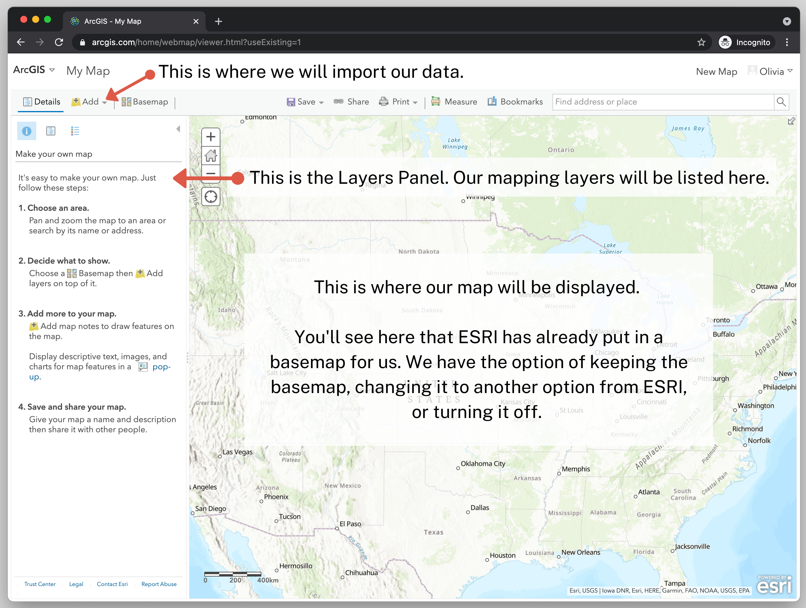

← [Exporting Data from QGIS](08-exporting-data-from-qgis.md)&nbsp;&nbsp;&nbsp;|&nbsp;&nbsp;&nbsp;[Changing the Map Style](10-changing-the-map-style.md) →

---

# 9. Importing Data to ArcGIS Online

Now we will be using ArcGIS Online to make the map interactive. Remember that we could have done everything in ArcGIS if we had the paid version, but since we are working with the free public version we cannot perform any spatial operations, such as the spatial join that we just did. That's why we used QGIS first. Now that we have the data exactly how we want it, we can use ArcGIS for free to visualize the data and create an interactive map.

## Login to ArcGIS Online and Setup Interface

First, you'll have to set yourself up with a free ArcGIS Online public account. To do so, open [ArcGIS Online](https://www.arcgis.com), and click "Sign in." If you don't already have an account, you can create one for free using your email, or your Google, Facebook or Github account.

Once you've logged in, let's open a new map project by selecting "Map" in the main menu.

Let's get acquainted with the interface.

## Create a New Map and Add Your Data from QGIS to ArcGIS

Now, let's import and format our neighborhoods shapefile.

1. Click on **Add**.
2. Click **Add Layer from File**.
3. Select **Choose File**. Then navigate to where you have the GeoJSON `NYCntaPerBlack` file saved on your computer.
4. Select "Generalize features for web display". I've tried making maps with both this option and "Keep original features" and I've never noticed any difference. 
  - ArcGIS describes the benefits of this feature the following way: Generalizing reduces the precision of the shapefile layer to approximately 1 meter in Web Mercator and will remove vertices within 10 meters in Web Mercator. This should maintain an informative and accurate display of your features while reducing the overall size of your data and allowing your layer to quickly display in the map.

6. Click **Import Layer**.

You should now see something that looks like a map of New York City, where some automatic attribute (for example, borough) has been chosen by ArcGIS for coloration. In the example below, ArcGIS has automatically selected borough as an attribute to color on the map.

---

← [Exporting Data from QGIS](08-exporting-data-from-qgis.md)&nbsp;&nbsp;&nbsp;|&nbsp;&nbsp;&nbsp;[Changing the Map Style](10-changing-the-map-style.md) →