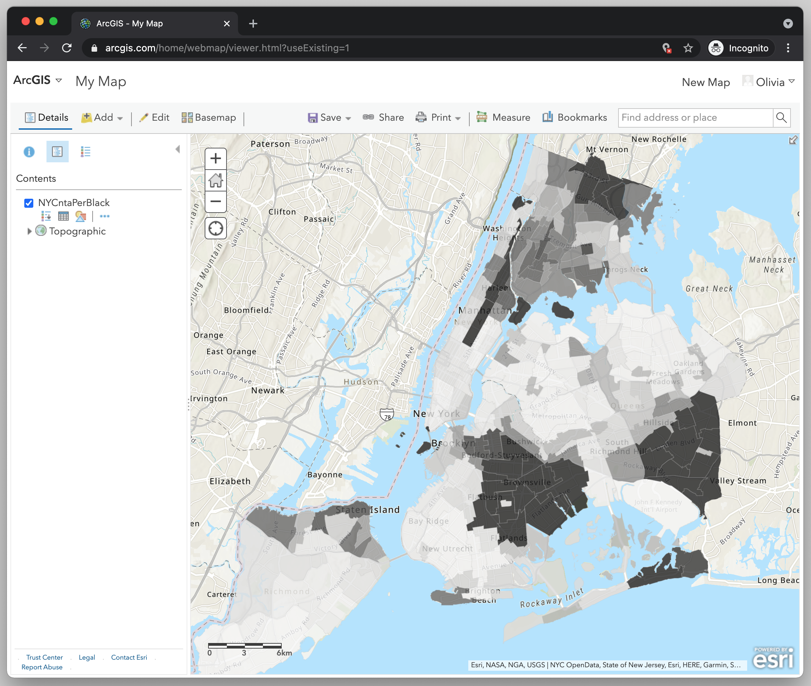

← [Importing Data to ArcGIS Online](09-importing-data-to-arcgis-online.md)&nbsp;&nbsp;&nbsp;|&nbsp;&nbsp;&nbsp;[Configuring the Pop-up](11-configuring-the-pop-up.md) →

---

# 10. Changing the Map Style

Let's change the attribute so that the colors represent the percentage of Black population in New York City's neighborhoods.

1. Under **Choose an attribute to show**, select `BINHP` which stands for Black Non-Hispanic Population.
2. Click around with the Drawing Styles to see which you think works best. I would suggest using the first option, a choropleth map style that shows the value by the intensity of the color.

Let's change the color to something that makes sense.

1. In the **Counts and Amounts** (Color) box click **Options**.
2. Click **Symbols**, and change the color. I'm selecting the black/white color ramp since I think it fits in with the story I'm trying to tell.
3. Once you've chosen your [color ramp](https://github.com/DHRI-Curriculum/glossary/blob/v2.0/terms/colorramp.md), click **OK**.
4. Optional: You can click on **Classify** if you want to change how the data is visualized and how many categories are created. "Natural breaks" is a good option because it increases variability between classes while decreasing it within classes.
5. Click the **OK** button at the bottom of the Layers Panel.
6. Finally, click **Done** to save your changes to the map. If you don't click Done, it will revert to what you had before.

You should now see your maps styled with your new color ramp. You'll also see the `NYCntaPerBlack` map layer in the Layers Panel.

## Challenge

Play around with the symbology settings more. See how the map looks when you change the transparency, the number of classes and other features. To go back to the symbology settings, hover over the name of the map layer in the layers panel and select the *change style* button (the one with with three shapes--circle square and triangle). Then click *Options*.

## Keywords
- [color ramp](https://github.com/DHRI-Curriculum/glossary/blob/v2.0/terms/colorramp.md)

---

← [Importing Data to ArcGIS Online](09-importing-data-to-arcgis-online.md)&nbsp;&nbsp;&nbsp;|&nbsp;&nbsp;&nbsp;[Configuring the Pop-up](11-configuring-the-pop-up.md) →