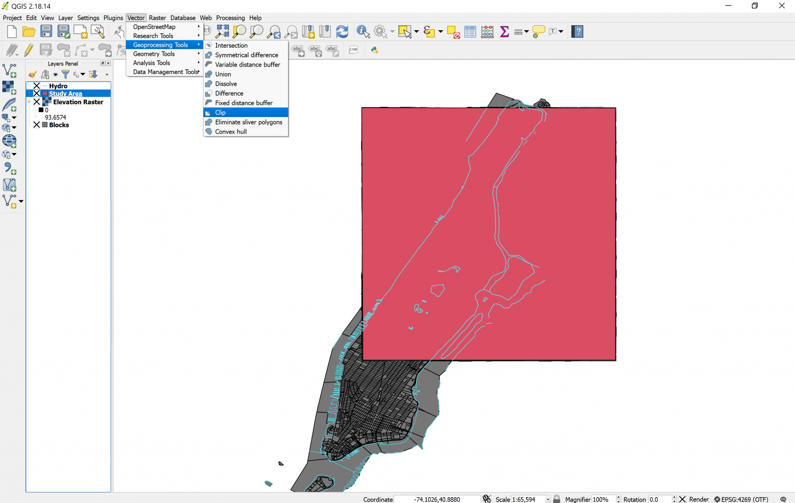

[<<< Previous](9polydrw.md)  | [Next >>>](11buffer.md)  

# Geoprocessing Tools: Clipping

Now we are ready to do some operations. We will use the `Vector Geoprocessing Tool` called `Clip`, to crop the area of the Blocks layer to the study area. We don’t need to crop the Hydro layer because the target of our study is the Blocks, not the hydrography. So:

* In the menu toolbar, click on the `Vector` menu.
* In the `Geoprocessing Tools`, click on `Clip`.

* In the `Clip` dialog box, choose Blocks as your input layer, and Study Area as your Clip layer. In reality, QGIS never really edits layers when you do operations to them, instead, it creates a new layer resulting of your operation. 
* In the `Clipped` box, you can specify the name of the new layer, or you can leave it blank to create a temporary layer. I suggest you leave it blank because we will clip this further to determine the areas vulnerable to flood. 
* Click `OK`.
* The resulting layer will be named “clipped” by default, let’s rename it “Blocks Study Area”.

If you toggle the Blocks layer visibility off, you will notice that the Blocks Study Area layer looks like a copy of Blocks, limited to the square of the study area. If you look at the `Attribute table` of the Blocks Study Area layer, you will notice that it has all the same attributes than the original Blocks layer, only that the features that were outside of the study area were deleted, which is just what we wanted. Now we can permanently turn off the visibility of Blocks and of Study Area (clicking on the `X` to the left of the layer names), and our work should now look like this:

[<<< Previous](9polydrw.md)  | [Next >>>](11buffer.md)  
