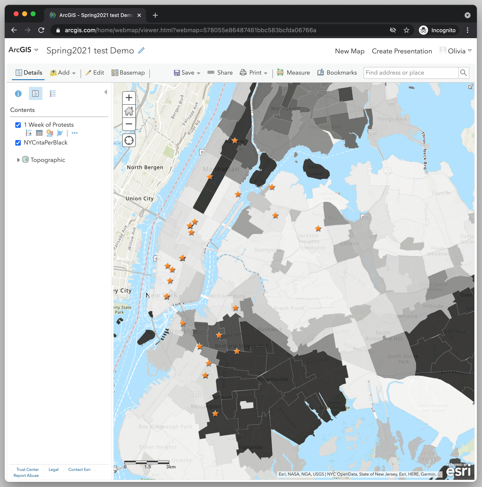

← [Importing CSV file and Geocoding Addresses](10-importing-csv-file-and-geocoding-addresses.md)&nbsp;&nbsp;&nbsp;|&nbsp;&nbsp;&nbsp;[Formatting the Pop-ups for the Protest Locations](12-formatting-the-pop-ups-for-the-protest-locations.md) →

---

# 11. Changing the Style of the Points Layer

Now you should see a series of points on top of the neighborhood map layer. ArcGIS Online will automatically choose an attribute to use to style the point layer. In my example it chose "Start location." 

Let’s change the style of the points layer. I’m not really interested in displaying any particular attribute along with the protests. I just want to see the location of the protests. 
1. Under **Choose an attribute to show**, select "Show location only."
2. Now let’s change the color of the points. In the box that says Location (single symbol) choose **OPTIONS**. 
3. Select Symbols. 
4. Feel free to play around with the options for the style of the point. You can change the shape, the fill color, the outline, and the size. You can even upload your own image. For mine, I chose an orange star that’s size 12.
5. Select **OK**.
6. And select **OK** again.
7. Finally, select **DONE** to save your changes.  

With this map we should already be able to answer our research question. We wanted to know if there might be a relationship between the location of BLM protests and the racial demographic of the neighborhood, specifically if the neighborhood is majority Black. Here we can already see little correlation between the location of the protests and the racial demographic of the neighborhood. We can observe, however, that many of the protests are taking place in centrally located places in Manhattan and in some parts of Brooklyn. If we start clicking on the points we’ll also see that many of the location starting points are popular sites and meeting places, such as Times Square, Union Square, and Bryant Park.

---

← [Importing CSV file and Geocoding Addresses](10-importing-csv-file-and-geocoding-addresses.md)&nbsp;&nbsp;&nbsp;|&nbsp;&nbsp;&nbsp;[Formatting the Pop-ups for the Protest Locations](12-formatting-the-pop-ups-for-the-protest-locations.md) →