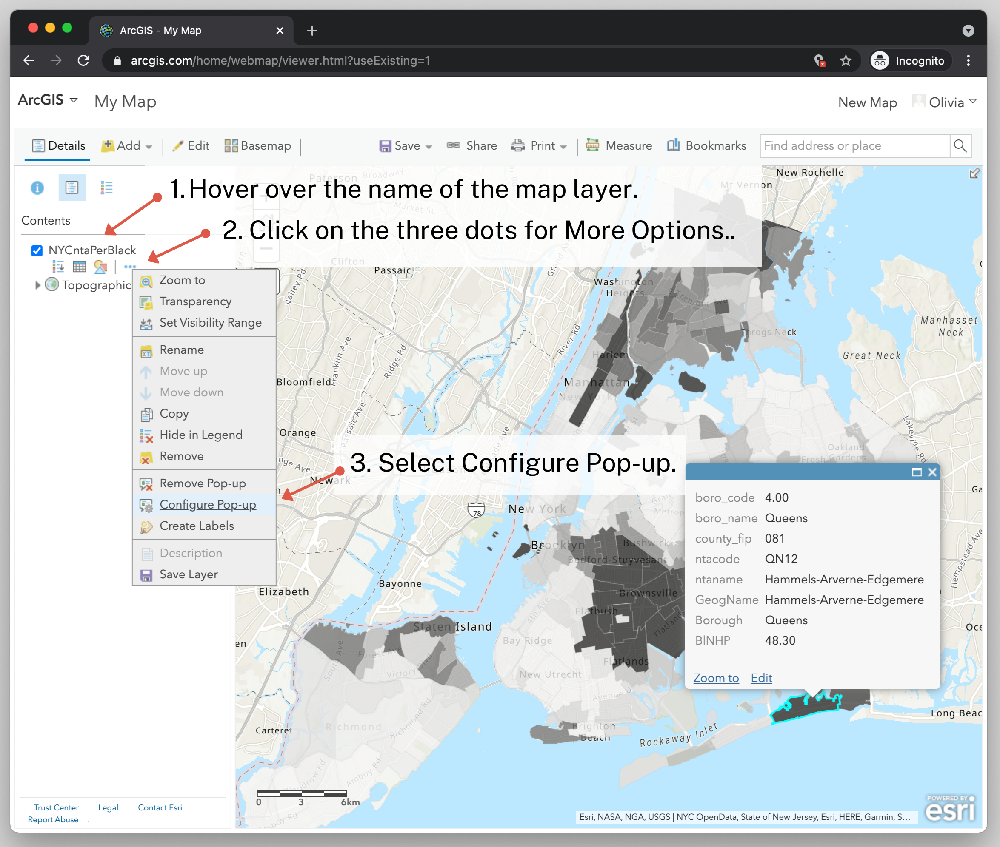
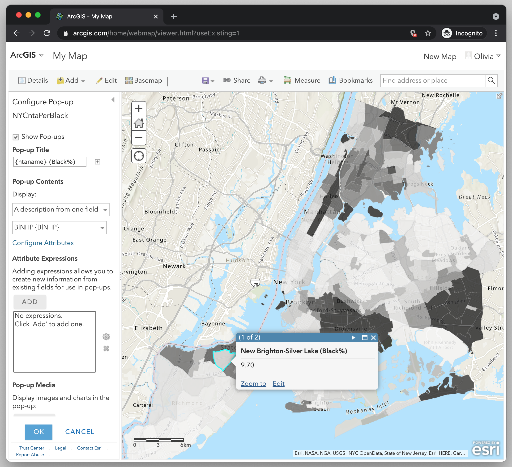

← [Changing the Map Style](10-changing-the-map-style.md)&nbsp;&nbsp;&nbsp;|&nbsp;&nbsp;&nbsp;[Importing CSV file and Geocoding Addresses](12-importing-csv-file-and-geocoding-addresses.md) →

---

# 11. Configuring the Pop-up

If you click on your map, you'll see a pop-up window with all of the information contained in the attribute table.

As you'll see, the pop-up doesn't look very nice. The names won't make much sense to the map viewer, and the viewer probably wouldn't be interested in some of the information, like the `ntacode`.

Let's configure our pop-up so that it looks better and provides more useful information.

1. In the map's Layers Panel, **hover over** where it has the name of the shapefile `NYCntaPerBlack`, and you will see some options appear below it—"Show Legend", "Show Table", "Change Style", and "More Options."
2. Select **More Options** by clicking the three dots below the name of the map layer.
3. Select **Configure Pop-up**. The Layers Panel will turn into a panel for configuring the pop-up.

Let's explore the options that we have for the pop-up.

1. The first thing you'll see is a checkbox for turning on and off the pop-up. We're going to leave ours on.
2. In the **Pop-up Title**, you can enter a name that will be displayed at the top of every pop-up box. You can type in something. Or you can have one of the attributes displayed. Let's have the neighborhood name displayed in the pop-up title. To do this, **click the plus sign** to the right of the text box and select `ntaname`. Next to `ntaname`, write "(Black%). Now the title will show the name of the neighborhood and the text "(Black%)".
3. In the **Display**, select the drop-down to see the list of options. The options for what you can display in the pop-up are "A list of attributes", "A description from one field", "A custom attribute display", and "no attribute information". We are going to select **A description from one field** since we are only interested in showing the value for Percent Black. Then in the next drop-down **select `BINHP`**.
4. Then click **OK** to save our changes.

Now when you click on the map you should see a popup with just the name of the neighborhood plus the text "(Black%)" and then in the box you will see the value for Percent Black.

---

← [Changing the Map Style](10-changing-the-map-style.md)&nbsp;&nbsp;&nbsp;|&nbsp;&nbsp;&nbsp;[Importing CSV file and Geocoding Addresses](12-importing-csv-file-and-geocoding-addresses.md) →