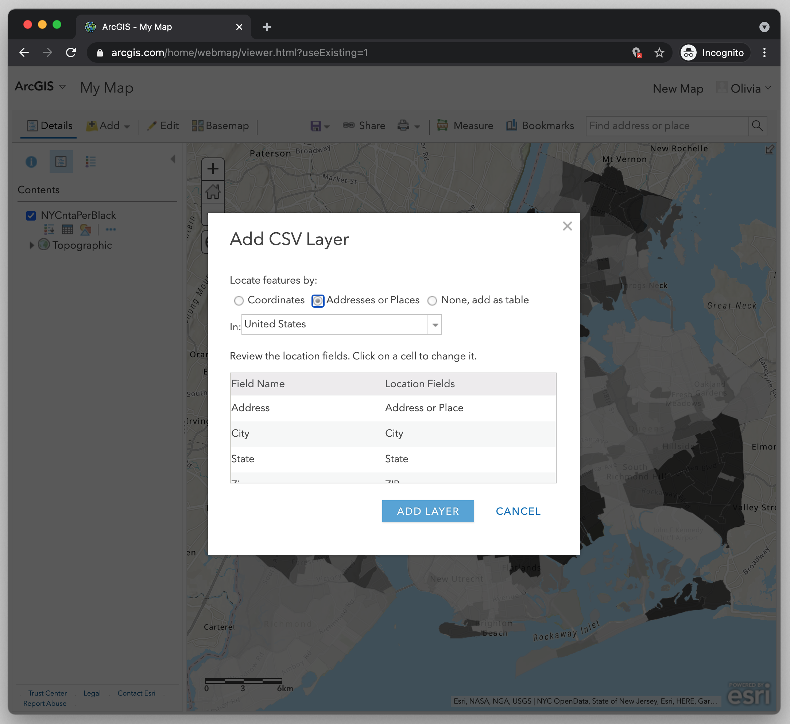

← [Configuring the Pop-up](10-configuring-the-pop-up.md)&nbsp;&nbsp;&nbsp;|&nbsp;&nbsp;&nbsp;[Changing the Style of the Points Layer](12-changing-the-style-of-the-points-layer.md) →

---

# 11. Importing CSV file and Geocoding Addresses

Now we're ready to import our next mapping layer. This one will be the CSV file that we have of several BLM protests that took place during one week in June. We want to layer this data as points on our choropleth map in order to see if the protests tended to take place in neighborhoods that were majority Black, or not.<!-- TODO: add link to "cloropleth" from glossary to this lesson -->

Let's import the file.

1. Select **Add**.
2. Select **Add Layer from File**.
3. Select **Choose File**, and navigate to where you have the file `1 Week of Protests.csv` saved on your computer.
4. Select **Import Layer**.

At this point a box should appear that says "Add CSV Layer" at the top and has information about location, coordinates and addresses.

This is the ArcGIS's way of asking you if you want to convert the addresses that are stored in the CSV file into points on the map. This process is called "geocoding." Geocoding will only work if you have addresses or coordinates stored in your CSV file, and luckily we do! If you open the CSV file in a spreadsheet manager, you'll see that we have the fields `address`, `city`, `state` and `zip`. This is all the geocoding process will need to be able to locate the address for each protest and create a map layer of points.<!-- TODO: add new term to glossary: geocoding -->

To geocode the CSV file, the **Field Name** column (pulled from the CSV file) needs to match with the **Location Fields** column (which is the geocoder column). Make sure that the following fields match:

1. Field Name: Address = Location Fields: Address or Place
2. Field Name: City = Location Fields: City
3. Field Name: State = Location Fields: State
4. Field Name: Zip = Location Fields: Zip

If they don't match, then click on the cell(s) to change it. Most likely, since the mapping software is pretty good at this stuff, they will all be automatically matched, so you won't have to change anything. Finally, click **Add Layer**.

## Note on Geocoding Limits

Note: ArcGIS will only geocode up to 100 entries. If you have more than 100, you can use the Census Geocoder which allows you to geocode up to 1000 entries.

---

← [Configuring the Pop-up](10-configuring-the-pop-up.md)&nbsp;&nbsp;&nbsp;|&nbsp;&nbsp;&nbsp;[Changing the Style of the Points Layer](12-changing-the-style-of-the-points-layer.md) →