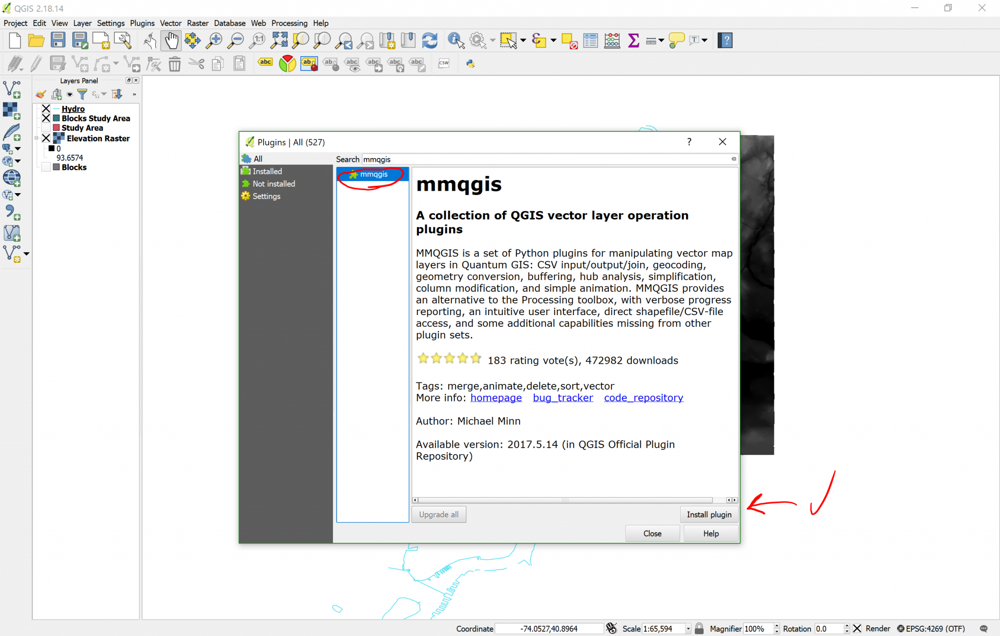
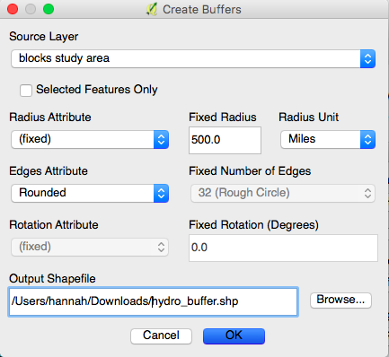
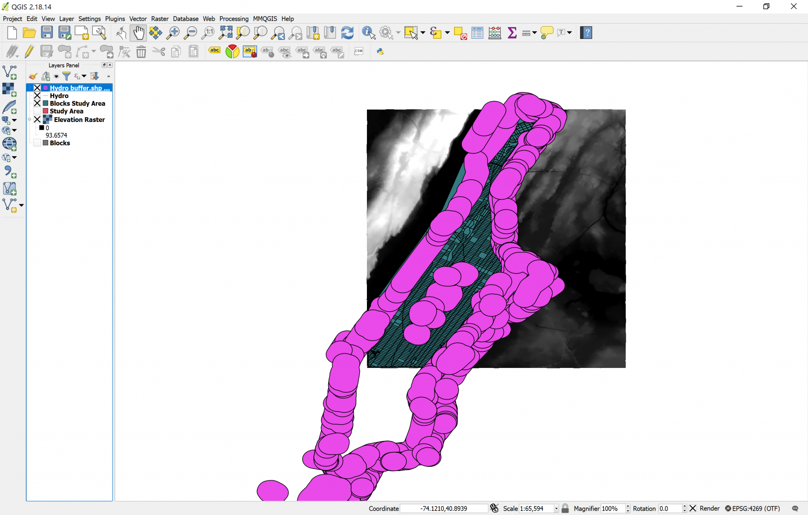

[<<< Previous](6layer2.md)  | [Next >>>](14differ.md)  

# Adding a Plugin & Creating a Buffer Zone

The next step in our task is to calculate the inland areas that will potentially be affected by flood. We will achieve this following two steps: the first step is to create a buffer zone of 500m from the coastlines (defined by the Hydro layer lines), and the second step is to confront that buffer to elevation, to make sure that our map shows areas that would be safe because they are higher than 15m above the sea level. For the first step, we could create a buffer using the `fixed distance buffer` geoprocessing tool (in the same menu we found `Clip`), however, we won’t do that because the layer is not projected in a CRS based on distance but on degrees, so distance-based operations would be warped. Then, we will take this opportunity to introduce one of the awesome things about QGIS: Plugins.

The Open-source nature of QGIS means that many people around the world are constantly developing plugins that improve the capabilities of the software. In this case, we will download a plugin called `MMQGIS` that offers many practical tools that always interpret distances accurately, regardless of the CRS you’re using. Note that to install plugins you’ll need an Internet connection.

* Click on the `Plugins` menu.
* Click on `Manage and Install Plugins…`. 
* Wait for the list to load, then write "mmqgis" on the `Search bar`. 
* Click on MMQGIS on the results and then you can proceed to read the description of the plugin.
* Click on `Install plugin`.

Now, you’ll notice that a new menu `MMQGIS` showed up on your `Menu Toolbar`.

* Click on the `MMQGIS` menu.
* Click on `Create`.
* Click on `Create Buffer`.

* Choose Hydro as the source layer.
* Select a `Fixed Radius` of 500 meters.
* Name the Output Shapefile “hydro_buffer” and place it in a convenient directory in your computer. NOTE: you MUST select a different filename and folder than the default, otherwise you will get an error.
* Leave everything else as is, and click `OK`. 

Your result should look something like this:

[<<< Previous](6layer2.md)  | [Next >>>](14differ.md)  
