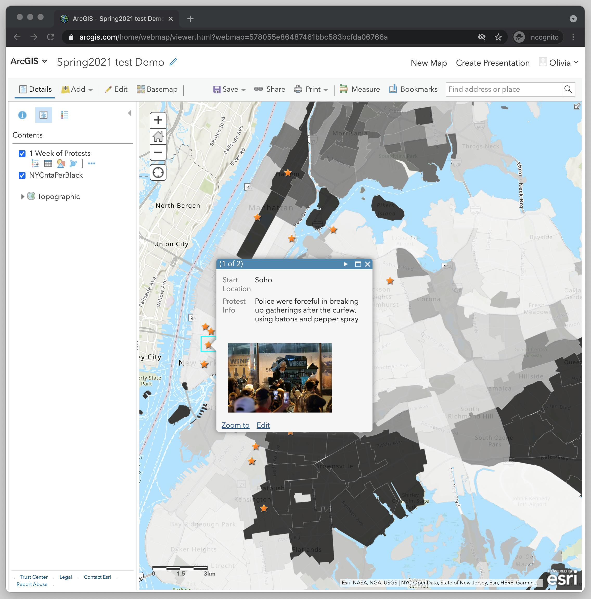

← [Changing the Style of the Points Layer](11-changing-the-style-of-the-points-layer.md)&nbsp;&nbsp;&nbsp;|&nbsp;&nbsp;&nbsp;[Formatting the Legend](13-formatting-the-legend.md) →

---

# 12. Formatting the Pop-ups for the Protest Locations

Let’s format the pop-ups for the protest locations so that the map viewer can learn more about the sites. The attributes that can be displayed are: “Date”, “Start Location”, “Address”, “City”, “State”, “Zip”, “Photo”,	“Details”. 

Out of these options, let’s display the “Start location”, “photo” and “details.”

1. In the **Map Layers Panel**, hover over where it has the name of the points layer “1 Week of Protest” and select the three dots for **More Options**. Then select **Configure Pop-up**.
2. In **Pop-up Title** write “BLM Protest”
3. In **Display** select “A list of field attributes.”
4. Select **Configure Attributes**. 

Now you should see a place where you can decide which attributes to display by clicking the checkboxes under the **Display** column. You can also edit the **TextBox Type** by having the checkboxes under the **Edit** column selected. Lastly, you can change the name that appears for the attribute in the pop-up. To do this click on the words in the column **Field Alias** and it will allow you to put in new text. Let’s try some of these options.

1. In the **Display** column select “Start Location” and “Details.” Even though we also want to add “photo” we are not going to check that off here. Media needs to be configured through a different process, which we’ll do next. 
2. You don’t have to change anything in the **Edit** column. 
3. Under Field Alias click on the word “Details” and change it to “Protest info.”
4. Click OK.

Now let’s add our photo to the pop-up.

1. Under **Pop-up Media** select **Add < Image**. 
2. In **Title** delete the text and leave it blank.
3. Leave the Caption blank.
4. For the **URL**, click the plus sign and select “Photo”. You might have to scroll down to find it in the list of attributes. 
5. Click **OK**.

Click **OK** again to save your changes. 

Now you should see a nicer looking pop-up when you click on the points on your map. Some points don’t have any “Protest info”, but for all of them you should see the “Start location” and photo. 

---

← [Changing the Style of the Points Layer](11-changing-the-style-of-the-points-layer.md)&nbsp;&nbsp;&nbsp;|&nbsp;&nbsp;&nbsp;[Formatting the Legend](13-formatting-the-legend.md) →