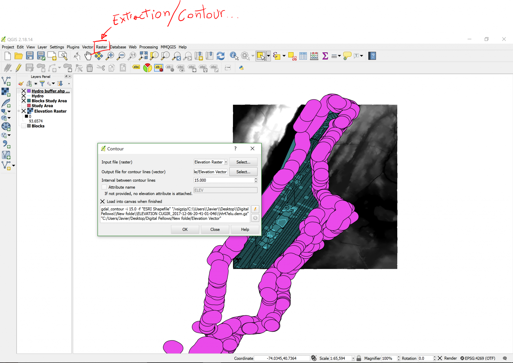

[<<< Previous](11buffer.md)  | [Next >>>](13lines2.md)  

# Extracting the Contour from a Raster Image

The first step is ready. Now comes the second step, which is to contrast this buffer versus the elevation. Since rasters and vector layers have limited interaction, let’s make a vector layer out of the elevation raster so that we can do an operation between the Hydro buffer and elevation. To do this, we are going to click on the Raster menu, then Extraction, and finally Contour. In this dialog box, the input file will be the Elevation Raster. The Output file, let’s call it Elevation Vector (save it in the same folder as everything else), and for the interval contour between lines, lets make it 15. We know this elevation map is in meters, so the first produced line will be from 0-15m, then the next one from 15-30m, and so on. Although we only care about the differentiation between whether it is above or below 15m elevation, as in this exercise, that’s the arbitrarily-chosen threshold between potentially flooding and not.

When you click OK, you will know you were successful if colored lines appear in the contours of the white areas in the raster image.

[<<< Previous](11buffer.md)  | [Next >>>](13lines2.md)  