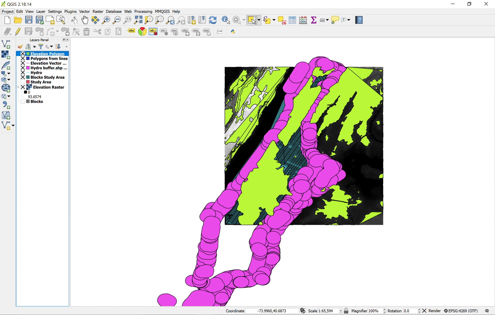

[<<< Previous](12cntour.md)  | [Next >>>](14differ.md)  

# Geometry Tool: Lines to Polygons

To make the distinction clearer, we will turn the lines of the contour layer into polygons:

* Go in the `Vector` menu.
* Select the `Geometry Tools` submenu.
* Click on `lines to polygons`.
* Run it on the contour layer.

You will get yet a new temporary layer showing solid areas. These areas represent everything that is over 15m elevation in the Study Area. In the New Jersey shore there may be areas of the vector that do not match the raster, but do not worry about that; that happens because the processing tool gets confused with the elevation lines and doesn’t know when to interpret a line as higher or lower elevation. But this does not occur in Manhattan so we do not need to do a more tedious work of singling-out the 15m elevation line, making lines to close the elevations and re-running the lines to polygons tool.

But that doesn’t mean we don’t have tedious work at hand. For instance, look at the properties of the new Polygons from lines layer. It adopted the CRS from the raster image, that is, EPSG:26718, NAD27 / UTM Zone 18N. This is not good because if we try to use geoprocessing tools when layers have different CRS, this may bring unexpected results. And as easy as just clicking on the drop-down and choosing the project’s CRS for this layer sounds, this is not the solution, because then unexpected things may happen, like the layer just disappearing. Instead, we need to:

* Right-click on the Polygons from lines layer in the `Layers` Panel.
* `Save as…` the Polygons from lines layer.
* In the `Save as` dialog, choose the proper CRS, that is, the EPSG:4269, NAD83.
* Let’s call the new layer “Elevation Polygon”.

The new layer will be added to your view. You will have to change the CRS for the Hydro Buffer as well, but for some reason, this one works fine if you change it from the drop-down in the layer `Properties`. So go ahead and do that. If it doesn't work for you this way, then follow the same process than for the previous layer.

[<<< Previous](12cntour.md)  | [Next >>>](14differ.md)  
