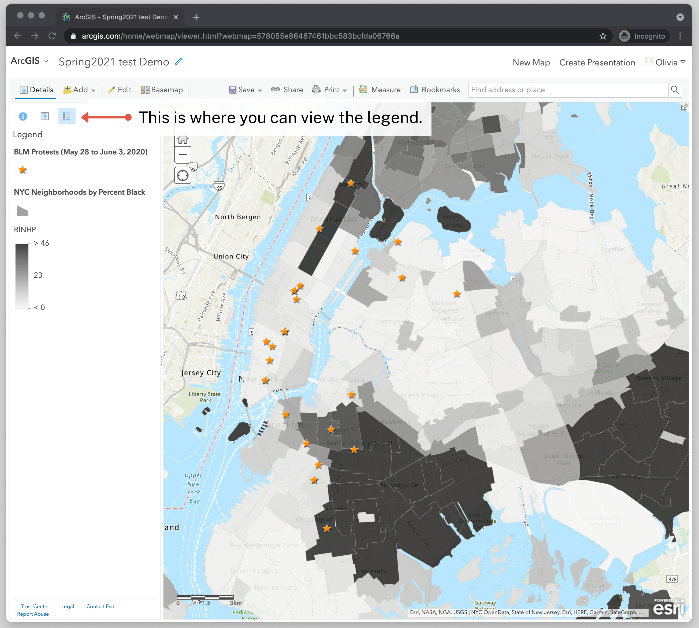

← [Formatting the Pop-ups for the Protest Locations](13-formatting-the-pop-ups-for-the-protest-locations.md)&nbsp;&nbsp;&nbsp;|&nbsp;&nbsp;&nbsp;[Saving and Sharing Your Map](15-saving-and-sharing-your-map.md) →

---

# 14. Formatting the Legend

<!-- TODO: We need a short intro to what the legend is here, I think -->

Let's have a quick look at the legend to make sure that it will be informative for our map viewer.

1. In the Map Layers Panel, at the top you should see three icons—an "i" with a blue circle around it, followed by a paper with blue writing, and then a bulleted list. Click on the icon that looks like a bulleted list; that's the legend icon.
2. I think the legend generally looks okay, but it currently displays the name of the map layer, which can be a little confusing for the viewer, especially the layer `NYCntaPerBlack`. Let's rename the layers so it will be easier for the viewer to understand.
3. Go back to the Map Layer panel where you can see the hyperlinked layers. You can do this by clicking the icon that looks like a white sheet of paper with blue writing.
4. Then click on the three dots for **More Options** and select **Rename**.
5. Do this for both layers to rename them something that's easier to read. I'm going to name mine "BLM Protests (May 28 to June 3, 2020)" and "NYC Neighborhoods by Percent Black."

---

← [Formatting the Pop-ups for the Protest Locations](13-formatting-the-pop-ups-for-the-protest-locations.md)&nbsp;&nbsp;&nbsp;|&nbsp;&nbsp;&nbsp;[Saving and Sharing Your Map](15-saving-and-sharing-your-map.md) →