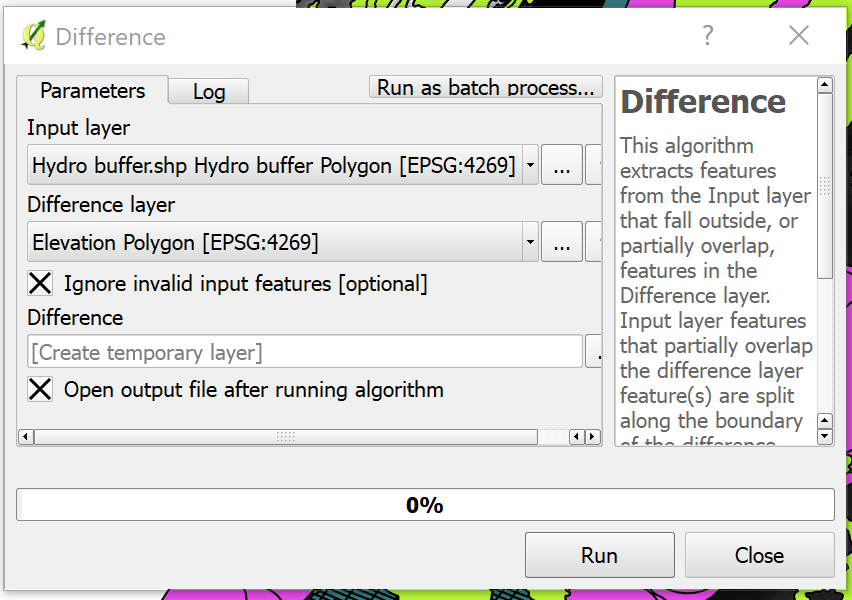
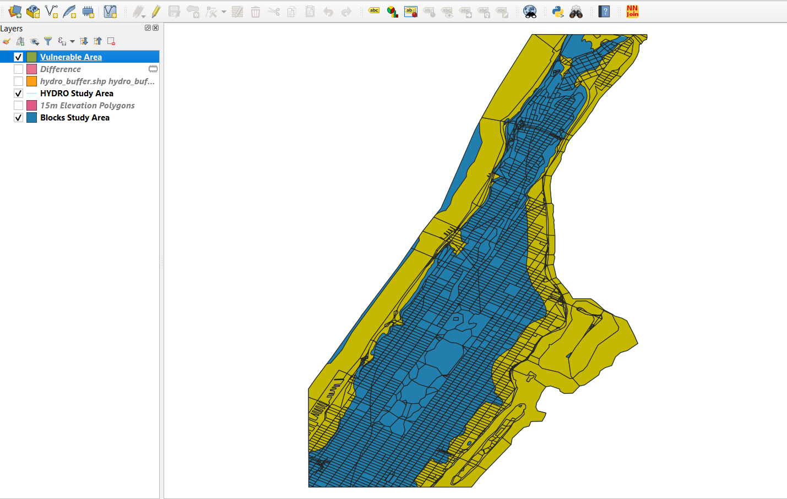

[<<< Previous](13lines2.md)  | [Next >>>](15calc.md)  

# Geoprocessing Tools: Difference and Clip

Now we are ready to confront the hydrography buffer versus the elevation. To do this:

* Navigate to the menu `Vector/Geoprocessing Tools`.
* Click on `Difference`.

`Difference` is a function like a geographic substraction: Wherever the two layers meet, the input layer will have substracted whatever trespasses the inner boundaries of the Difference layer.

* Use the Hydro Buffer as the input and the Elevation Polygon as the Difference overlay layer. 
* Be sure to check the `Ignore invalid input features` so that the operation goes smoothly.
* If you run into issues, it could be due to CRS incompatibility. Make sure that both the input and overlay layers are in the same CRS (Select the buffer layer, click on Save as, then choose EPSG:4269).

Now we have a new layer called Difference, which represents the 500 meters from the coastline inland that is under a 15-meter elevation.

The last step is to identify the Census Blocks that are within this area. To do so, we will use another geoprocessing tool called `Clipping`. 

`Clipping` basically works as a cookie cutter and selects all the features in a layer that are within the features of another layer, and removes anything that is outside these boundaries. To clip:

* Navigate to the menu `Vector/Geoprocessing Tools`.
* Click on `Clip`.
* The input layer is the one that has the information you want to analyze. In this case, it is "Blocks Study Area".
* The Overlay layer is the "Cookie cutter mold". This one will define the "shape" to be cut. So we will choose the Difference layer that resulted from the operation we did previously.
* Click on `Run`.

And there we have it. The orange area is the Vulnerable Area (go ahead and give the new Clipped layer this name). If we look at the attribute table of this layer, we can analyze the characteristics of the vulnerable population, according to the attributes that already existed in the original Census Blocks layer, such as Race, Age and Gender.

[<<< Previous](13lines2.md)  | [Next >>>](15calc.md)  
