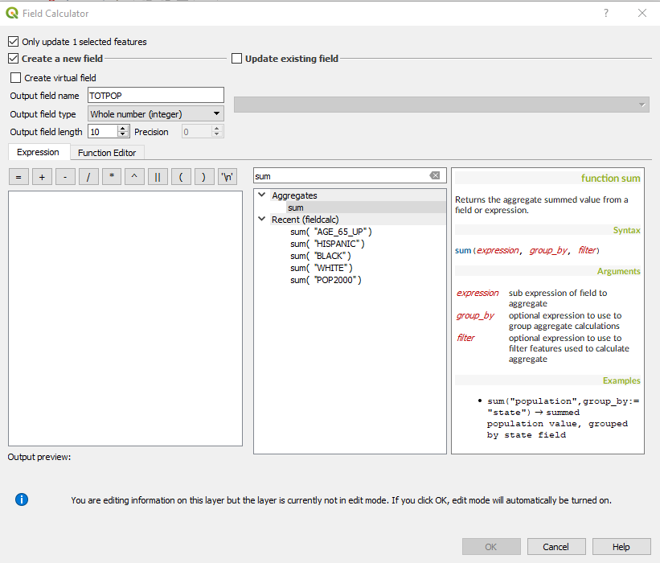

[<<< Previous](14differ.md)  | [Next >>>](16calc2.md)  

# Using the Field Calculator

Let's open the `Attributes Table` of the Vulnerable Area layer. You will notice that this layer has the exact same attributes than the Blocks layer, but fewer features, because it only kept the features that were within the clipped area. Let's look at the Pop2000 attribute. This one shows the total population per census block in 2000. What if we wanted to know the total population that lives in the vulnerable areas? To know this, the `Field Calculator` will be of use.

* In the `Attributes Table`, click on the `Field Calculator button` (shaped like an abacus). You will see this window pop up.



The Field Calculator allows you to create a new field based on calculations done on other fields in the same table. It is important that you write a name for the new field and also that you select the type of data that will be contained in it. For example, if we are counting population, a Whole number (integer) type will suffice, but if we are calculating percentages, we might want to choose a Decimal Number (real) type of data. We can also choose the `Precision`, which determines the number of decimals that will be shown for a decimal number.

The Calculation is determined by the `Expression` you write. A basic expression would involve operators such as `addition (+)`, `substraction (-)`, `division (/)` and `multiplication (*)`. To the right of the `expression field`, we have an organized list of all possible operations, functions and fields that can be used in expressions. To calculate the total population (let's call the field TOTPOP), we will perform a sum of the Pop2000 field:

* Search for `Sum` in the search bar on top of the list of functions. 
* Once the aggregates function "Sum" shows up on the list, double click on it to put it in the `expression box`. 
* Within the parentheses, we need to put the field that we want to sum. Search for Pop2000 on the list and double-click on it to add it to the expression. 
* Add a closing parentheses and the expression should look like this now:

```python
 sum(  "POP2000" )
```
 Under the Expression box, we have the "output preview" which indicates whether the expression is valid or not. If you didn't put the closing parentheses (or if there is any other error or typo), it will read "Expression is invalid". Otherwise, the Output preview should show a number; this means the expression is valid.
 
* Click `OK`, and we will have a new field TOTPOP showing the total vulnerable population.

*  You will notice that your table became `Editable` after you clicked `OK`, even if you were not editing it. If you want your new field to be saved, be sure to `toggle editing` off and save changes to the layer.

 [<<< Previous](14differ.md)  | [Next >>>](16calc2.md)  


