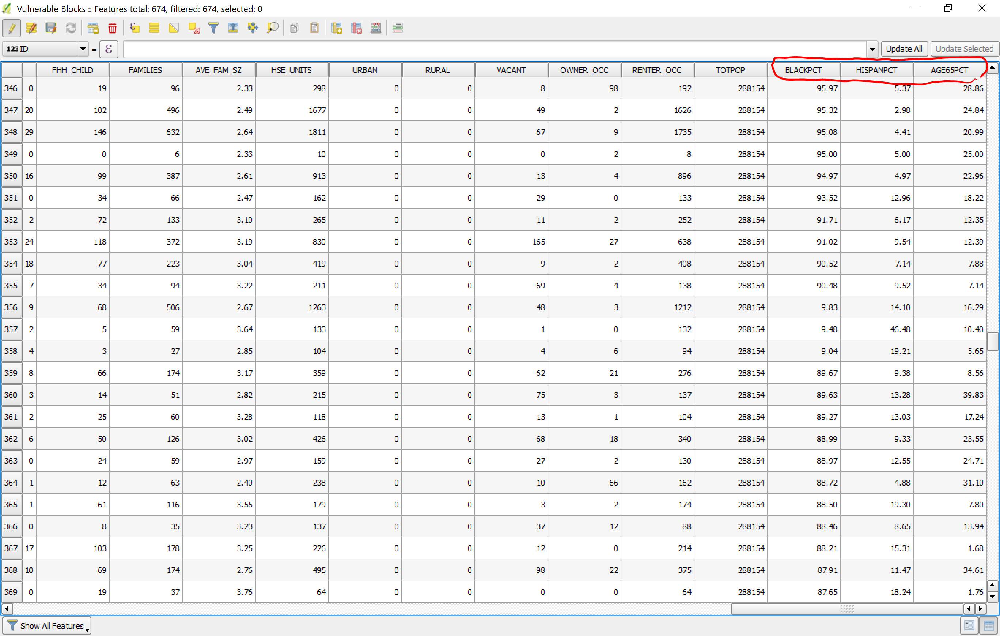

[<<< Previous](15calc.md)  | [Next >>>](17viz.md)  

# Calculating Percentages with the Field Calculator

Now, we will use the `Field Calculator` to make some porcentual fields that will allow us to create visualizations to see what our data can tell us about the people who are vulnerable to the floods. We will look at the percentage of Black/African American (Field: BLACK), the percentage of Hispanic population (field: HISPANIC), and the people aged 65 and over (field: AGE_65_UP). For each one of these, we will create a percentage using the `Field Calculator`.

The expression to create a percentage of Black population in a census block will be the following:
```python
 "BLACK" / "POP2000" * 100
```
 Be sure to change the type of field to Decimal Number (Real) and the precision to 2. Name this new field BLACKPCT and click OK.

 Now do the same for the HISPANIC field and for the AGE_65_UP field, and let's call these new fields HISPANPCT and AGE65PCT. Once you are done, the `Attributes Table` of the Vulnerable Area layer should look like this:



 Make sure to save changes to the layer when turning off `Edit mode`.

[<<< Previous](15calc.md)  | [Next >>>](17viz.md)  
