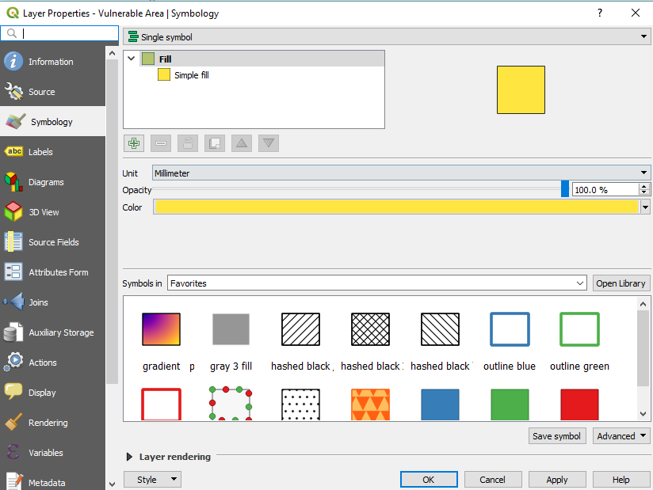
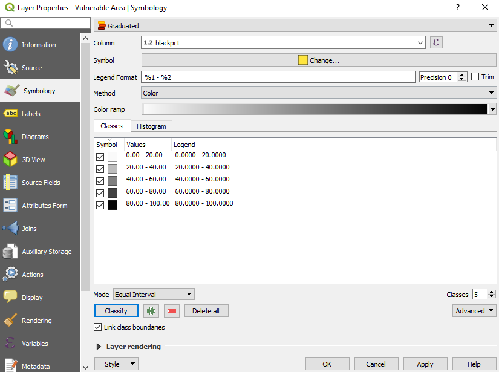
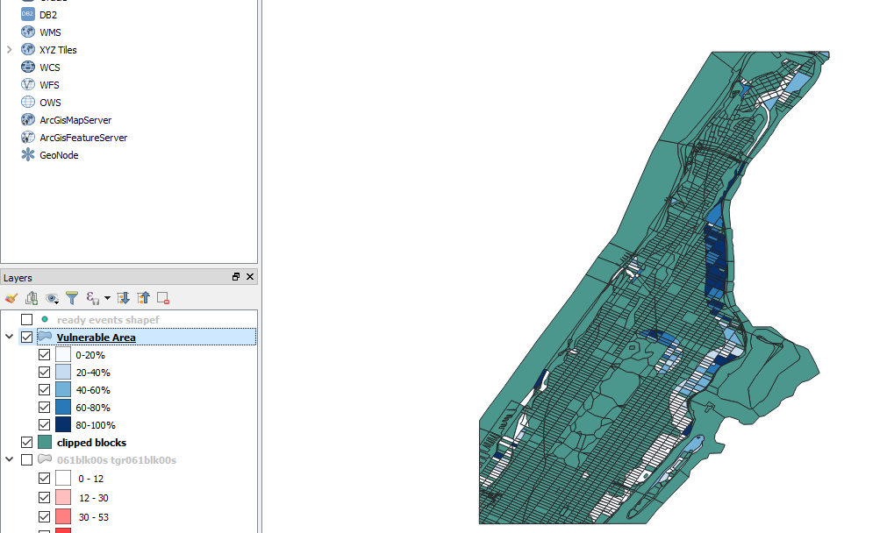

[<<< Previous](16calc2.md)  | [Next >>>](18extra.md)  

# Changing the Visualization of a Layer

In QGIS, we can change the visualization of any vector layer in the map, to have colors reflect different values and facilitate the visual analysis of our data. The newly created porcentual fields will be useful to try out different visualizations for the Vulnerable Area layer.

To start, let's open the properties box of the Vulnerable Area layer (Right-click on the layer and select Properties, or just double-click on it). Then, click on the Symbology tab. It should look like this:

If it doesn't look exactly the same, do not worry, it might be due to different versions of QGIS installed. On the top of the window, you will see a drop-down menu that is currently set to "Single Symbol". This is the choice that makes everything in the layer look the same color. Note that we can also select the "Opacity" here if we want to be able to see through layers. When clicking on this drop-down menu, we can choose any of the other ways to visualize the layer. The "Categorized" option is good when you have a limited number of possible values in a specific field. "Graduated" is more appropriate when there is a large amount of values -such as population numbers- so we will choose "Graduated" for this exercise.

Once you click on "Graduated", the window will show information pertinent to this type of symbology. "Column" refers to the field that the visualization will be based on. Let's choose BLACKPCT. The Classes box shows the different category boxes that will be used to display the data. It is currently empty, but if you click on "Classify" below, it will populate it automatically based on the selected Mode and the desired number of Classes. Clicking on it will result on something like this:

You can change the "Legend" by clicking on each class, to make a friendlier name. For example, 0.0000 - 20.0000 could be changed to 0-20%, and so on. Clicking on "Apply" will show the visualization on the map:

We can create similar visualizations to show colors for percentage of hispanics and percentage of people aged 65 and up. A way to do this is to duplicate the Vulnerable Area layer, then change the symbology for the duplicate. Changing the colors also help to distinguish the visualizations when you alternate between them. Sometimes equal intervals won't show an interesting distribution, so you can try changing it for other types to see if something in your data catches your eye. For example, "Natural Breaks (Jenks)" can be a helpful visualization when you want to emphasize variability between classes, so this one could be helpful for example in visualizing Age 65 & Up, as the porcentual range is much lower than the one of Hispanics or Black population. Go ahead a duplicate the layer twice and show visualizations for HISPANPCT and AGE65PCT. Make sure to select a different scale of colors, and very importantly, click again on the "Classify" button. Also, make sure to rename the Layers so that you do not forget what is being visualized on each. I chose to rename it using a parentheses, that is, Vulnerable Area (Black pct); Vulnerable Area (Hispanic pct); and Vulnerable Area (Age 65 & up pct).

[<<< Previous](16calc2.md)  | [Next >>>](18extra.md)  