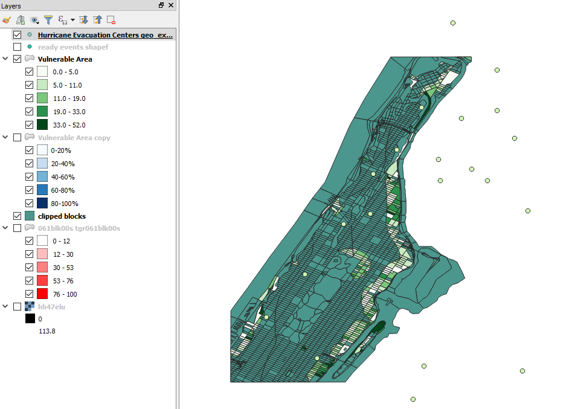
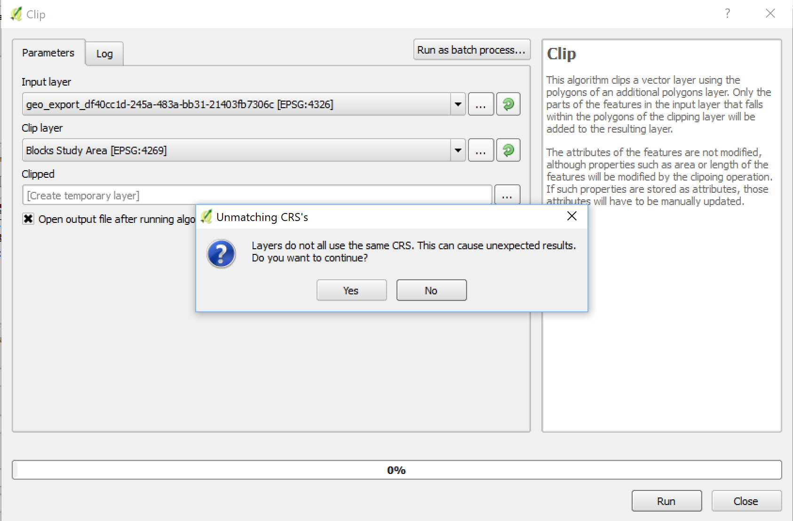
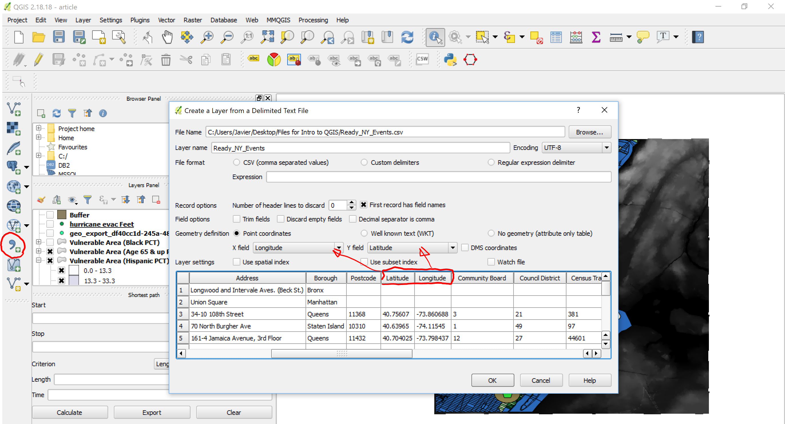
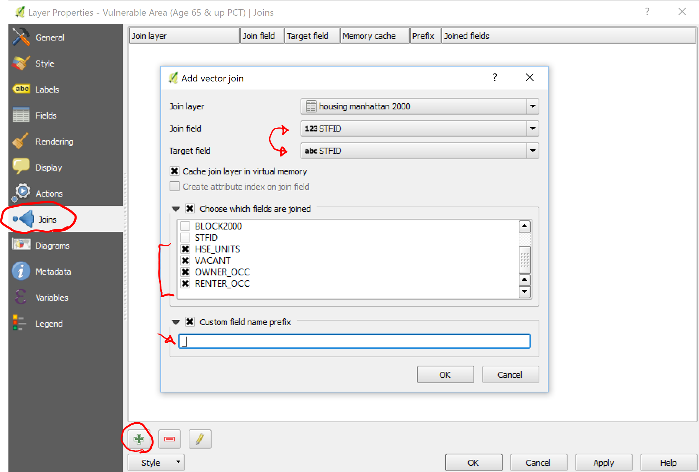
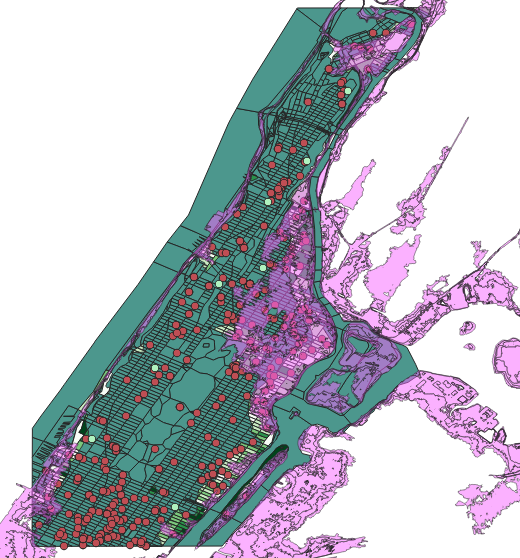

[<<< Previous](17viz.md)  | [Next >>>](19layout.md)  

# Additional Layers and Ideas for Analysis

Now that we have visualizations of some of the types of populations within the vulnerable areas, we can add other layers and analyze the relationships between population and the data in these other layers. For this example, we will look at a layer of Hurricane Evacuation Centers in New York City. Are these centers capable of sheltering all of the population in the vulnerable areas?

Opening the Hurricane Evacuation Centers layer, we see the following:



We can remove the points that are outside of the study area by Clipping it with the "Clipped Census Blocks to Study Area" layer (Just like we clipped other layers before). However, when you try to do it, you might get this error:



 When you get this error, know that whenever QGIS warns that there may be unexpected results, it means there WILL BE unexpected results. To avoid this you need to set the layer CRS to the project's. To do it:
 
 * Right-click on the layer.
 * Click on `Set Layer CRS`.
 * Select the appropriate CRS (EPSG:4269). 
 
 Note: Sometimes setting the CRS this way won't work, then you have to "Save as..." and choose the proper projection from the Save dialog box.
 
 

 Now you can run the Clipping tool. Note that there are some centers that are within the study area, but are not in Manhattan, so it's best to use the layer of the Blocks in the Study Area to clip the Hurricane Evacuation Centers. Once you do, rename this new layer "Evacuation Centers in Study Area", and open the Attributes Table. You will notice that there are only eight centers for the whole population. Here are some ideas of types of anaylsis you could do:

- You can divide the total vulnerable population by 8 to know how many people are expected to be sheltered in each of these Evacuation Centers. 
- You could also create a 500-meter (1640.42 feet) buffer around  to determine whether the centers are at a walkable distance for all the vulnerable population (see note below about creating buffers). Take closer attention to neighborhoods with high percentage of people 65 and up, who could have higher chances of difficulties to walk long distances. 
- Note that in the Attributes Table only four of the centers are "Accessible". Change the visualization of this layer to a Categorized version, where a color represents accessible centers (green) and another color represents non-accessible (red).

## About creating buffers

Something important that you need to know is that QGIS works in "map units", determined by the project's CRS (that's why to avoid this, we used the MMQGIS plugin earlier). For geospatial operations to be done properly, all layers involved must be in the same CRS, and this CRS is ideally the same of the project. Some CRS use degrees as units, some use meters, or feet, or miles. If you are working with a CRS that uses degrees, such as EPSG:4269, a trick to do buffers properly is to save your dataset into a CRS that uses your desired unit (for example, EPSG:102718 is a proper projection of NYC that uses feet), then change your project's CRS to the same one than the layer, and then do the buffer, and "Save as..." a layer in the original CRS of your project (in this case, EPSG:4269). Then revert your project to the original CRS and you will have the properly projected buffers.

## Adding a CSV file as a layer

Databases with no geographic information such as Comma-Separated-Values (CSV) files can also be added to QGIS. If they do not have geographic information (i.e. they cannot be projected on the map), the data can still be used by joining it to a projected dataset using a common element, and that is what we are going to do next. 

* Let's open the file "housing manhattan 2000.csv", by clicking on the `Add Delimited Text layer` button on the right-side menu (shaped like a comma). If the database has geographic data, such as Latitude and Longitude coordinates, QGIS will identify this and automatically suggest to use these to create a point vector layer. 



* This dataset doesn't have latitude/longitude, so we will have to add it with no geometry, so check the `no geometry` button. Make sure that CSV is selected as the file type, then you should see a preview of the data on the window. Click "Accept".

You will notice a new layer on the layer pane, identified with a text icon, which is QGIS' way to tell you that this layer is not represented on the map.

## Table Join

In order to use the Housing data, we have to join it to our working dataset, that is, the vulnerable area layer (note that we could also join it to other compatible layers, such as census blocks 2000). To do this:

* Right-click on the Vulnerable area layer.
* Click on `Properties`,
* Select the `Joins` tab.
* Click on the plus sign `+` button to add a new join.



* You will need to identify the join field and target field. This refers to the fields in the joining and the joined datasets that are going to be used as a reference for the join, that is, so that QGIS knows to which elements belong the attributes being added. If an attribute of this join field is not found in the joined table, it will be ignored. You can choose which fields are joined, and I suggest checking the last four so that you do not get duplicate fields. 

* Lastly, QGIS chooses a default name prefix for the joined fields, based on the filename. I strongly suggest changing this to something very short ("_", for example), because these files are in Shapefile format which fields are limited to maximum 10 characters, so you will lose the information of what each number is when you save the layer.

* Once you click on `OK`, make sure you also click `OK` in the `Layer Properties` box, and now you can open the `Attributes table` and see your newly added fields. Now you can run an analysis of housing situation for the vulnerable blocks.

## Adding a CSV file with Geometry

Now let's add the Ready NY Events CSV file. The process will be similar than adding the last CSV, but this time, make sure that `Geometry definition` is set to `Point coordinates`, and that `Latitude` and `Longitude` are being extracted from the appropriate fields. When you click `Accept`, you will likely see a warining saying that CRS was not specified so it chooses a default one. You can right-click on the layer to select the correct projection (EPSG:4269). 

When opening the `Attributes Table`, you will notice that there is information on the date of the events, and the names of the events. Events may vary considerably, as some are open to the public (for example, Citizen Preparedness Training), while others seem to be targeted at specific or exclusive audiences (Annual CLIP Teacher Conference, ABC/Disney General Presentation). Do these events occur in the most vulnerable areas? The following exercise will let us find out and practice our QGIS skills.

## Creating Booleans with the Field Calculator

First, we are going to prepare the NY Events database. We will only look at recent events, that is, events 2015 and on. However, the dates are written in an uncomfortable format (MM/DD/YYYY), because it is actually detected as a `String`. We are going to turn this into a boolean that will tell us whether an event is recent (value of 1) or not (value of 0). We will use this useful conditional formula in the `Field Calculator`:

```Python
CASE
WHEN  "Event Date"  LIKE '%2017' THEN 1
WHEN  "Event Date"  LIKE '%2016' THEN 1
WHEN  "Event Date"  LIKE '%2015' THEN 1
ELSE 0
END
```
What this formula does is look at all the values of Event Date, and if they end in 2017, 2016 or 2015, it will give the new field being created a value of 1, otherwise the value will be 0.

We could even delete older events because they would not be helpful for this particular question.

## Comparing layers

A final layer that we can overlay with our data is the one of Hurricane Inundation Zones - Worst Case. This is a layer prepared by USGS to determine what areas could potentially be affected in the case of Hurricanes (basically what we did, but with a more complex algorythm).



Here are some ideas to use this layer:

- Change its opacity to 50% in the Symbology and lay it over the Vulnerable areas. Does it correspond to the area that we identified? If not, what could be the reason?
- Open the attributes table. You will notice a column called "Category". This refers to the category of hurricanes. If we select categories 1 & 2, we can notice that the selected area resembles the Vulnerable Area of our study, so perhaps our simulated event was in fact equivalent to a Category 2 Hurricane.
- Note that due to the complexity of this layer, operations such as Clipping will take much longer. Since we are only using this layer for comparative purposes, there is no need to clip it to our study area. We can just turn the layer off once we are done comparing.

[<<< Previous](17viz.md)  | [Next >>>](19layout.md)  
