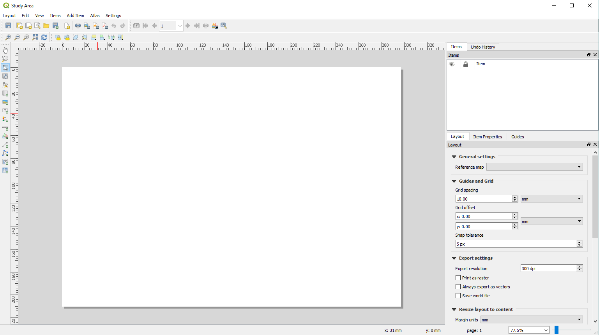
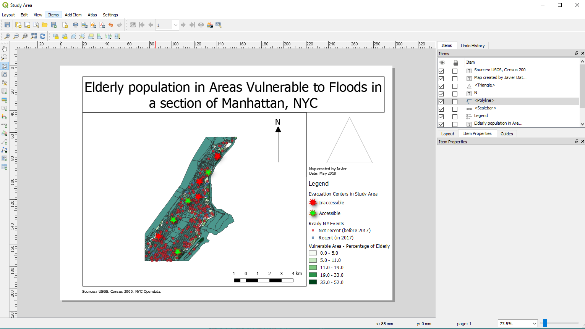

[<<< Previous](18extra.md)  | [Next >>>](20more.md)  

# Layout: Making a printable and shareable product with QGIS

QGIS is most frequently used as a tool of geospatial data analysis, but it can also be used to create thematic maps that can be shared with a team or with the public. This is what the "Layout" function is for. To use it, click on the "New Print Layout" button. You will see this:

This is what the page you print will look like. Now you can add elements to it to create your printable map. First, click on the "Add new map" button. Your cursor will turn into a crosshair, that you will use to define a square or rectangular area in your layout where the map will be. Click and hold, then release to create a rectangle making sure to leave room on the top for the title of your map, and on the side for the legend and any other information you may want to add. Note that the map will look exactly like what your QGIS window is currently showing. If you want to change the view, click on "Set map to canvas extent" in the Item Properties box. If you changed the symbols of elements of the map, you can click on "Update preview" in the map properties box.

## Adding a title to your layout

Now let's add the title. Click on the "Add a new Label" button. Again, you will have to click and hold then release to create the rectangle where the text will be. For now, it will just say "Lorem Ipsum" in small font. To change the text and format it, you have to click on the "Item Properties" tab on the right of the Layout. The "Main Properties" box is the text that will actually be displayed. The options under this box will allow you to format the text to your liking. You will also have an option to add a frame, among other visual tweaks that you may be interested in including in your map.

## Adding a legend to your layout

A thematic map is not very useful if we do not know what is being represented. This is why the legend is so important. Click on the "Add legend" button to add a legend. When you add it, you will notice that it will basically show everything that you had in your Layers dialog box in the QGIS window. If you change something there, it will change in the layout too. To customize the legend and remove any elements you do not want to show in this particular layout, you have to disable the "Auto Update" feature in the Legend Item Properties. Once you do, you will be able to rename and remove items to your liking.

## Adding other elements to your layout

You should add a scale ("Add scale" button) and an arrow indicating North ("Add arrow" button, then "Add Label" and write an N on it). Don't forget to add date, creator of the map, and sources. Additionally, you can add Images or shapes to customize further the map, to add the logo of your company or photo details of particular areas of the map.

Once you are satisfied with your layout, you can click on "Print" to have it saved as a PDF or printed on paper.

[<<< Previous](18extra.md)  | [Next >>>](20more.md)  