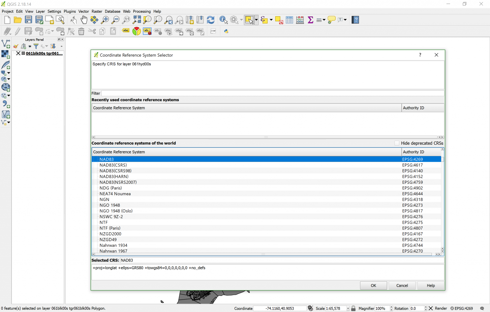
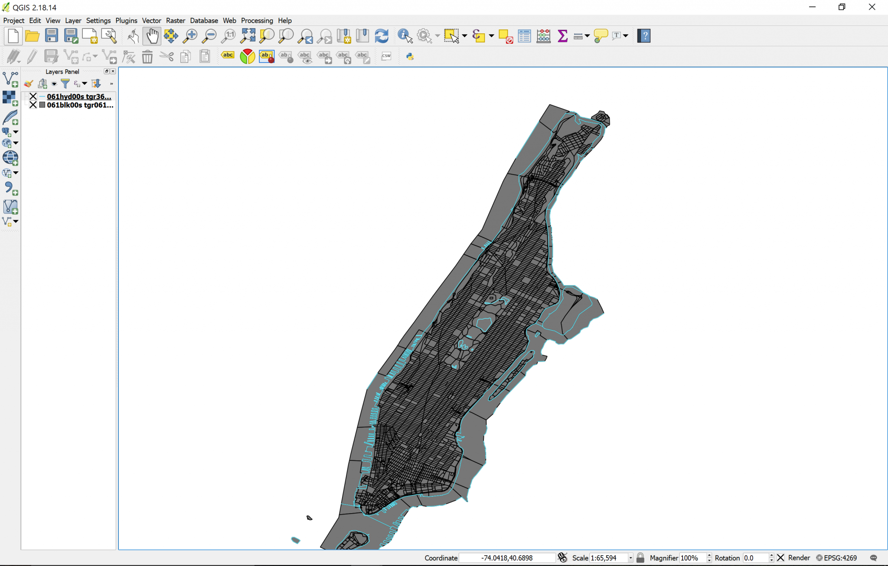

[<<< Previous](5attrib.md)  | [Next >>>](7raster.md)  

# Adding a Second Vector Layer & Harmonizing CRS

Now that we have customized our layer and seen the attribute table, let’s go ahead and open a second layer: the Hydrography one (061hyd00s.zip). Open it following the instructions for the Blocks layer. If you did it right, you will end up with a new window we hadn’t seen before, called the `Coordinate Reference System Selector`. The reason this happens is because the Hydrography layer, for some reason, did not have information about the CRS. So it is up to us to choose which CRS we want it to be projected on.

Note: if you did not get this dialog box, it could be due to the fact that `On-the-fly CRS` is on, which means that all layers you open will be adapted to the CRS of the first layer you opened, but if this is your first time using QGIS, you should get this. To turn off `On-the-fly`:

* Click on the CRS name on the lower right.
* Uncheck the box that reads `Enable On the Fly (OTF) Transformation`.
* Click on `Accept`.

Now, since you want all layers to be in the same CRS, go ahead and look for the same projection of the Blocks layer. You may recall looking at it on the `Layer Properties` dialog box. Look for EPSG:4269, NAD83. You can write EPSG:4269 in the filter box and it will facilitate the search for you. Once you select the proper CRS, click `OK` and the layer should be projected on top of the Blocks one, like this:

Congratulations, now you have two layers on QGIS. Feel free to explore the new layers attribute table, properties, change the color, and I also recommend that you rename both layers to something more practical, like “Blocks” and “Hydro”. This is a good idea so that you can always easily locate the main layers, as the operations that we will do will multiply the number of layers. To rename a layer:

* Right-click on its name in the layers panel.
* Select the last option in the menu, `rename`. 

You can also toggle the visibility of layers on/off by clicking on the `X` to the left of the layer’s name. Also remember that you can make a layer transparent in the `Style` tab of the `Properties` dialog box. Further, you can drag and drop layers in your preferred order, knowing that the most visible layer (the one on top) will always be the first one. Knowing these features will be useful when too many layers are open and you want to focus on a specific group or one in particular.

[<<< Previous](5attrib.md)  | [Next >>>](7raster.md)  
