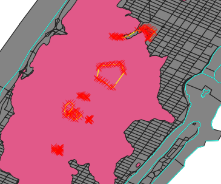

[<<< Previous](6layer2.md)  | [Next >>>](11buffer.md)  

# Editing a Layer and Deleting Features

Let's take a close look at the Hydro layer. To do so, click and hold on the HYDRO layer name on the Layers Panel and drag it to the top of the list, so that we see it on top of any other layer.  
You will notice that there are some lines in the middle of Manhattan. Those are the lines of the lakes of Central Park. Since the flood is in the river, we don't need these lakes, so we are going to remove them. To do so:  

* Make sure the Hydro layer is selected on the Layers Panel.
* Click on the `Toggle Editing` button (looks like a pencil). Note: each layer's Editing mode is independent from the others.
* Click on the `Select Features` button. Note: there are different types of Select tools if you click on the drop-down arrow. I suggest `Select features by area or single click` (looks like an arrow on a yellow square).
* Click on one of the lakes. You should see red X's appearing as you select. You can hold down `Shift` to select more than one feature.
* Once you select all the lakes (make sure you didn't accidentally select part of the outer hydro line), you can click on the `Delete Selected` (red trash) button or press the `Del` key to delete them.
* If you accidentally selected something you don't want to delete, you can click on the `Deselect all` button (yellow square with a no-no red sign) and retry your selection.

Once you are done deleting the lakes, we can turn `Editing Mode `off. To do so, click again on the `Toggle Editing` button. You will get a prompt to save changes, say `yes`. Now the layer file has permanently changed.

[<<< Previous](6layer2.md)  | [Next >>>](11buffer.md)  
