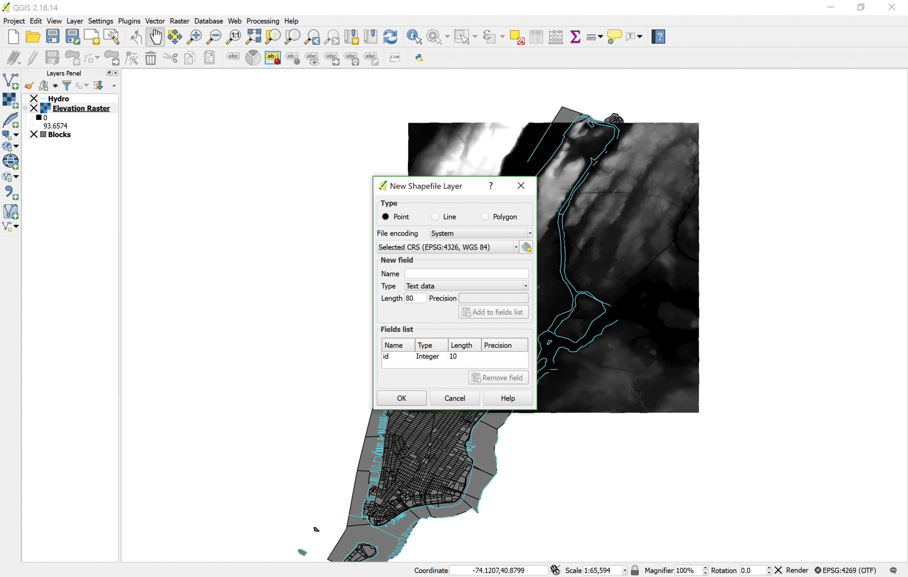

[<<< Previous](7raster.md)  | [Next >>>](9polydrw.md)  

# Creating a New Vector Layer

To create a new layer, click on the bottom button in the Layers bar, called “New Shapefile Layer” (looks like a V with a small yellow star next to it). Go ahead and click on it. You will get the Create New Shapefile Layer dialog box:

Here, make sure to select “Polygon” as the type. Then, click on the drop-down for the CRS and make sure you choose EPSG:4269, NAT83 as the CRS, instead of the default EPSG:4326, WGS 84. Click OK, and QGIS will prompt you to Save the blank layer on your hard drive. Save it in a familiar location, and call it Study Area. Study Area will be added to your Layers Panel, but we can’t see anything because it doesn’t have any features yet. Here we only need one feature, and we are going to draw it, tracing a square over the Raster image.

[<<< Previous](7raster.md)  | [Next >>>](9polydrw.md)  