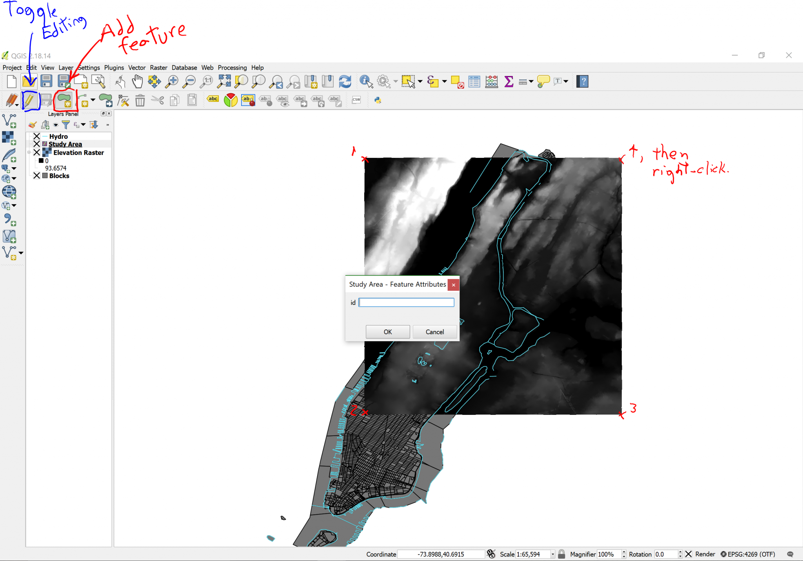

[<<< Previous](8newlayr.md)  | [Next >>>](10clip.md)  

# Drawing a Polygon

To draw a Polygon, we have to Toggle editing mode on, by clicking on the Pencil icon (second icon from the left in the second toolbar). As you click on it, you will notice that previously greyed-out icons will be enabled. Two icons right of the “Toggle editing” button, you will find the “Add feature” button (looks like a blob with a small yellow star to the right), which is precisely what we need, so go ahead and click it. Now your cursor is armed to draw. Click on the upper-right corner of the raster image, then on the lower-right, then the lower-left and finally the upper left. Then right-click. Don’t worry if you’re not super-precise; for this exercise we don’t need surgeon precision, we’re just practicing, exploring and learning.

Once you right-click, a box will pop-up asking you to write an id. You can leave this blank and click on OK. When you do, a colored square will cover the whole raster image area. Since we don’t need to edit this layer further, click on the Toggle editing button again. A dialog will ask you if you want to save the changes, say yes.

[<<< Previous](8newlayr.md)  | [Next >>>](10clip.md)  