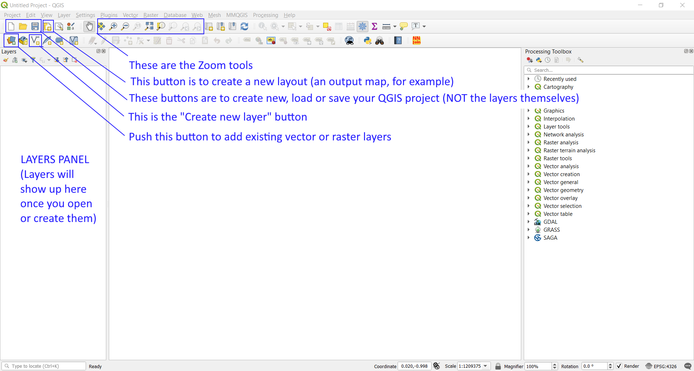
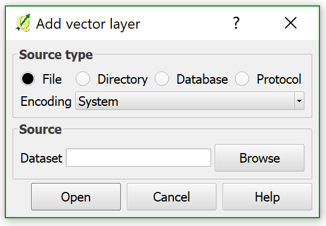
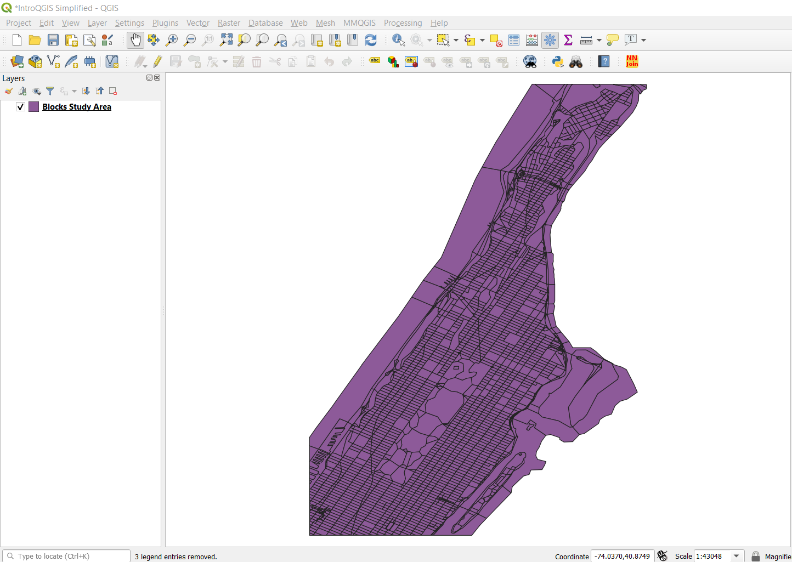

[<<< Previous](setup.md)  | [Next >>>](layerpro.md)  

# Adding a Vector Layer

Once you finish installing QGIS and downloading the required layers, go ahead and open the QGIS Desktop app. After loading time, you should see something like this:

On the image above, I highlighted a few areas and buttons related to layers: The Add Vector Layer button, the Add Raster Layer button, the Create New Layer button, and the Layers Panel. We will not use the Browser Panel so you can go ahead and close this one clicking on the X on the top-right corner of the panel.

Whenever you add a layer to your project, it will be shown in the Layers Panel. Let’s go ahead and open the Census Blocks layer by clicking on the Add Vector Layer button. A dialog like this one should open:

Here, click on Browse, go in the BLOCKS folder and select the 061blk00s.zip file directly. When you select it and click on Open, you should get this:

[<<< Previous](setup.md)  | [Next >>>](layerpro.md)  