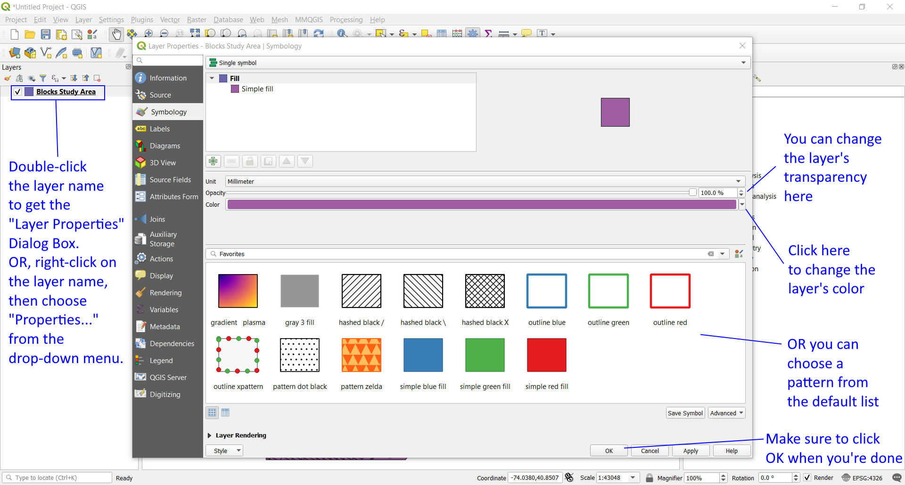

[<<< Previous](layer1.md)  | [Next >>>](attrib.md)  

# Layer Properties & Customization

As you can see from the shapes in the layer, this is a polygon vector layer. Each polygon represents a census block, and all together compose the shape of Manhattan. Note that the color of your layer might be different from the one in the images of this tutorial; QGIS chooses layer colors at random when you first open or create one. If for any reason you’d like to change the color of the layer, you can do it by double-clicking on the layer name in the Layers Panel (“061blk00s tgr061…”) to bring up the Layer Properties box. There, you can click on the Style tab on the left side and you’ll be able to customize the look and color of the layer. To change the color, click on the colored bar drop-down where it says “Color”. Above it, you’ll notice a transparency bar, which can be useful if you want to visualize more than one layer that overlaps. Go ahead and experiment with the styles and choose a visualization to your liking.

Since you already are on the Properties box, click on General so that we can check out the Coordinate Reference System. You will see that this layer’s Coordinate Reference System (CRS) is “Selected CRS (EPSG:4269, NAD83)”. Keep that in mind and close the Layer Properties dialog box.

[<<< Previous](layer1.md)  | [Next >>>](attrib.md)  