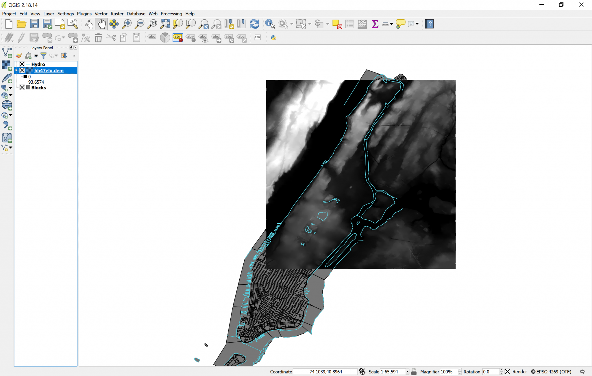

[<<< Previous](layer2.md)  | [Next >>>](newlayer.md)  

# Adding a Raster Layer

Now, let’s get the third layer into play: the raster layer. To open it, we must click on the Add Raster Layer button, right below the Add Vector Layer button. Then, we search for the Elevation folder, and click on hh47elu.dem.gz. When we do, a black square image will appear on the map area:

That raster is a Digital Elevation Map, and the colors reflect altitude: the dark levels are 0, while the white levels are the higher altitudes. Let’s explore the raster layer a bit. I chose to rename it “Elevation Raster”. In the properties dialog box, we can see in the General tab that the CRS for this raster layer is very different from the other two layers; still, the layer is perfectly aligned with the other two on the map. Why? Because QGIS has an option called On-The-Fly, which aligns all projections to the CRS of the first layer you opened. You can check that On-The-Fly is active by looking at the lower-right area of your QGIS window, where you will see EPSG:4269 (OTF). The OTF means On-The-Fly is active, and it was not active before we opened this new raster layer.

Also note that the square does not cover the whole Manhattan, but just a fraction of it. For practicity’s sake, we will define this square area as our “study area”, so we will disregard anything that is not within this box. To do this, we will create a new layer from scratch, and we will draw a polygon in the shape of the raster layer.

[<<< Previous](layer2.md)  | [Next >>>](newlayer.md)  